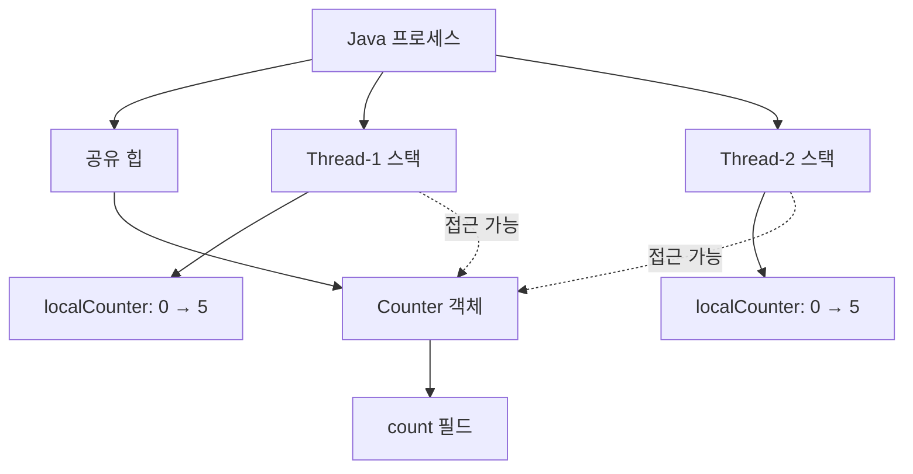
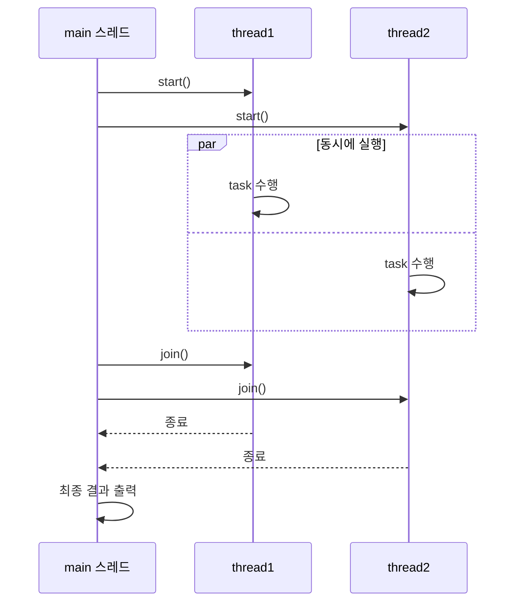
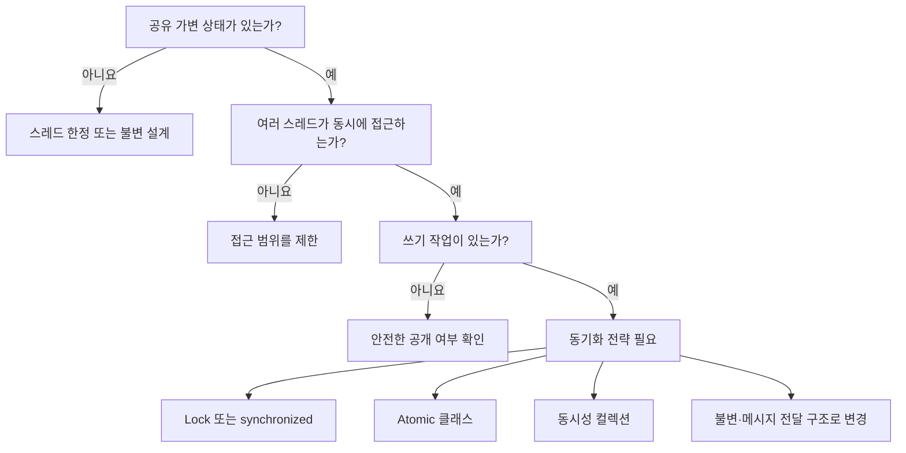

# Solution01: 스레드 메모리와 경쟁 상태

`Solution01.java`는 두 가지를 비교한다.

1. 메서드 안의 지역 변수는 스레드마다 독립적이다.
2. 여러 스레드가 같은 객체의 필드를 수정하면 경쟁 상태가 발생할 수 있다.

## 1. 초심자용

### 먼저 알아둘 용어

| 용어 | 쉬운 설명 | 코드 속 예시 |
|---|---|---|
| 프로세스 | 실행 중인 프로그램 | JVM에서 실행 중인 Java 프로그램 |
| 스레드 | 프로세스 안에서 작업을 수행하는 실행 흐름 | `thread1`, `thread2` |
| 스택 | 각 스레드가 자기 메서드 호출과 지역 변수를 보관하는 공간 | `localCounter`, 반복문의 `i` |
| 힙 | 여러 스레드가 함께 접근할 수 있는 객체가 저장되는 공간 | `Counter` 객체와 `count` 필드 |
| 공유 자원 | 둘 이상의 스레드가 함께 사용하는 데이터 | 하나의 `counter` 객체 |
| 경쟁 상태 | 실행 순서에 따라 결과가 달라지는 상태 | 두 스레드가 동시에 `count++` 수행 |

### 스택과 힙의 차이

`runIsolation()`의 두 스레드는 같은 `Runnable`을 실행하지만, `localCounter`는 각 스레드가 호출한 메서드의 지역 변수다. 따라서 한 스레드의 값 변경이 다른 스레드의 값에 영향을 주지 않는다.



| 구분 | 스택의 지역 변수 | 힙의 객체 필드 |
|---|---|---|
| 코드 | `localCounter` | `counter.count` |
| 기본 소유 범위 | 스레드별 | 객체를 참조하는 스레드들이 공유 가능 |
| 동시 접근 문제 | 일반적으로 없음 | 변경 시 동기화가 필요할 수 있음 |
| 예제의 결과 | 각 스레드가 각각 1부터 5까지 증가 | 최종값이 항상 100,000이라고 보장할 수 없음 |

> 객체가 힙에 있다는 사실만으로 무조건 문제가 생기는 것은 아니다. 여러 스레드가 같은 가변 객체를 동시에 읽고 쓸 때 문제가 된다.

### `start()`와 `join()`

```java
thread1.start();
thread2.start();
thread1.join();
thread2.join();
```

| 메서드 | 의미 |
|---|---|
| `start()` | 새 스레드를 시작하고 그 스레드에서 `run()`을 실행한다. |
| `join()` | 대상 스레드가 끝날 때까지 현재 스레드를 기다리게 한다. |



`join()`은 작업 완료를 기다릴 뿐, `count++`를 안전하게 만들지는 않는다. 실행 완료 대기와 공유 자원 보호는 서로 다른 문제다.

### `count++`가 원자적이지 않은 이유

`count++`는 코드 한 줄이지만 개념적으로 세 단계다.


두 스레드가 같은 값을 읽으면 한 번의 증가가 사라질 수 있다.

| 순서 | Thread-1 | Thread-2 | 실제 `count` |
|---:|---|---|---:|
| 1 | `count`에서 10을 읽음 | | 10 |
| 2 | | `count`에서 10을 읽음 | 10 |
| 3 | 11을 계산 | 11을 계산 | 10 |
| 4 | 11을 저장 | | 11 |
| 5 | | 11을 저장 | 11 |

두 번 증가했지만 결과는 12가 아닌 11이다. 이를 **갱신 유실(lost update)** 이라고 한다.

### `sleep()`의 역할과 주의점

`Thread.sleep(...)`은 현재 스레드를 일정 시간 쉬게 하여 다른 스레드가 실행될 기회를 늘린다. 이 예제에서는 실행 순서가 섞이는 모습을 관찰하기 위해 사용한다.

- `sleep()`은 동기화 수단이 아니다.
- 정확한 실행 순서를 보장하지 않는다.
- 경쟁 상태를 더 잘 관찰하게 할 수 있지만, 항상 재현한다는 보장도 없다.
- 인터럽트가 발생하면 `InterruptedException`이 발생한다.

### 인터럽트 상태 복원

```java
catch (InterruptedException e) {
    Thread.currentThread().interrupt();
}
```

`InterruptedException`이 발생하면 인터럽트 상태가 지워진다. 현재 코드는 `interrupt()`를 다시 호출해 상위 로직이 중단 요청을 알 수 있도록 상태를 복원한다.

## 2. 면접 대비용

### 핵심 질문과 답변

| 질문 | 답변 핵심 |
|---|---|
| 스택은 왜 스레드 안전한가? | 각 스레드가 독립된 호출 스택을 가지므로 다른 스레드가 동일한 지역 변수 슬롯에 직접 접근하지 않는다. |
| 힙 객체는 항상 스레드 안전하지 않은가? | 아니다. 불변 객체, 스레드 한정 객체, 적절히 동기화된 객체는 안전하게 사용할 수 있다. |
| `count++`는 왜 위험한가? | 읽기-수정-쓰기의 복합 연산이어서 원자성이 보장되지 않는다. |
| `join()`이 경쟁 상태를 해결하는가? | 아니다. 종료 시점만 기다리며, 작업 중 공유 데이터에 대한 상호 배제를 제공하지 않는다. |
| `sleep()`으로 순서를 제어할 수 있는가? | 없다. 스케줄링 타이밍에 영향을 줄 뿐 순서와 가시성을 보장하지 않는다. |
| 경쟁 상태와 데이터 레이스의 차이는? | 경쟁 상태는 타이밍에 따라 결과가 달라지는 넓은 개념이다. 데이터 레이스는 동기화 없이 같은 메모리에 동시 접근하고 하나 이상이 쓰기인 경우를 말한다. |
| 원자성·가시성·순서성이란? | 연산이 쪼개지지 않는 성질, 한 스레드의 변경을 다른 스레드가 보는 성질, 연산 순서가 기대대로 관찰되는 성질이다. |

### Java 메모리 모델 관점

공유 변수의 올바른 동시성 처리는 다음 세 속성을 함께 고려해야 한다.

| 속성 | 질문 | `Solution01`의 상태 |
|---|---|---|
| 원자성 | 연산 도중 다른 스레드가 끼어들 수 있는가? | `count++`는 원자적이지 않다. |
| 가시성 | 변경값을 다른 스레드가 확실히 볼 수 있는가? | 증가 작업 자체에는 동기화가 없다. 다만 `join()` 이후에는 종료된 스레드의 작업 결과가 조인한 스레드에 보인다. |
| 순서성 | 컴파일러·CPU 재배치에도 의도한 순서가 유지되는가? | 동기화 규칙이 없다면 스레드 간 일반적인 순서를 가정할 수 없다. |



### 이 코드의 결과를 설명하는 답변 예시

> `runIsolation()`의 `localCounter`는 각 스레드의 호출 스택에 별도로 생성되므로 서로 간섭하지 않습니다. 반면 `runRaceCondition()`은 하나의 `Counter` 인스턴스를 두 스레드가 공유합니다. `count++`는 읽기-수정-쓰기 복합 연산이므로 두 스레드가 같은 값을 읽으면 갱신 유실이 발생할 수 있습니다. `join()` 덕분에 출력은 두 스레드 종료 후 수행되지만, 증가 연산의 원자성까지 보장하지는 않습니다.

### 해결 방법 비교

| 방법 | 장점 | 고려할 점 |
|---|---|---|
| `synchronized` | 문법이 간단하고 락 해제가 자동이다. | 세밀한 락 획득 정책은 제한적이다. |
| `ReentrantLock` | 시간 제한, 인터럽트 가능한 획득 등 기능이 많다. | 반드시 `finally`에서 직접 해제해야 한다. |
| `AtomicInteger` | 단순 카운터 연산에 간결하고 효율적이다. | 여러 상태를 한꺼번에 일관되게 변경하는 데는 부족할 수 있다. |
| 스레드 한정 | 공유 자체를 없애 가장 단순하게 만든다. | 결과를 합치는 별도 단계가 필요할 수 있다. |
| 불변 객체 | 상태 변경이 없어 공유가 안전하다. | 변경이 필요한 모델에서는 새 객체 생성 방식이 필요하다. |

### 추가 확인 문제

1. 두 스레드가 각각 50,000번 증가해도 결과가 100,000보다 작을 수 있는 이유는 무엇인가?
2. `join()`을 제거하면 `main` 스레드의 출력 시점은 어떻게 달라지는가?
3. `count`에 `volatile`을 붙이는 것만으로 `count++` 문제가 해결되지 않는 이유는 무엇인가?
4. 공유 객체 대신 각 스레드가 별도 카운터를 사용하면 어떤 장단점이 있는가?

<details>
<summary>핵심 답안</summary>

1. `count++`의 읽기-수정-쓰기 단계가 겹쳐 갱신이 유실될 수 있다.
2. 작업 완료 전에 출력할 수 있어 중간값을 보게 된다.
3. `volatile`은 주로 가시성을 보장하지만 복합 연산 전체의 원자성을 보장하지 않는다.
4. 경쟁 상태는 사라지지만, 최종 합계를 계산하는 병합 과정이 필요하다.

</details>
