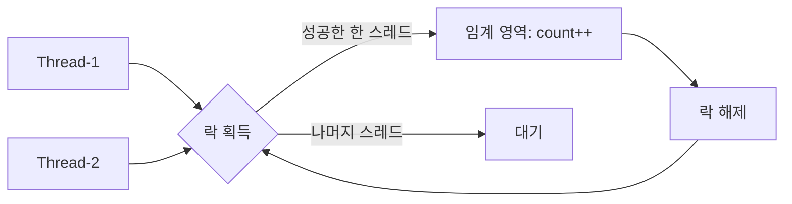
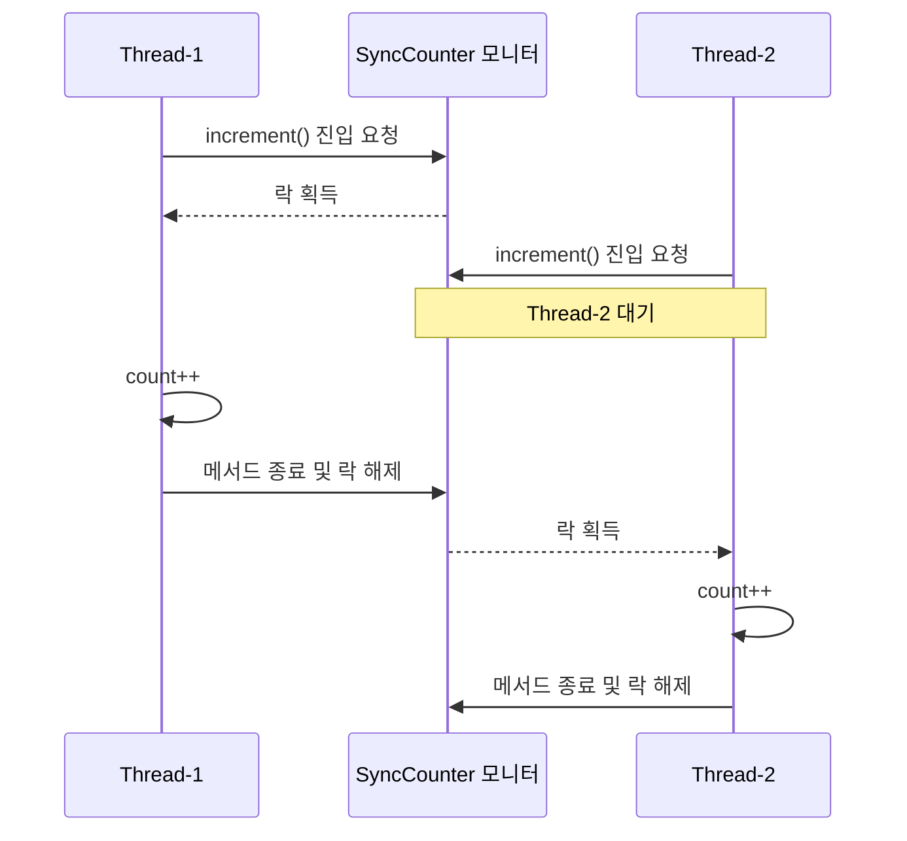
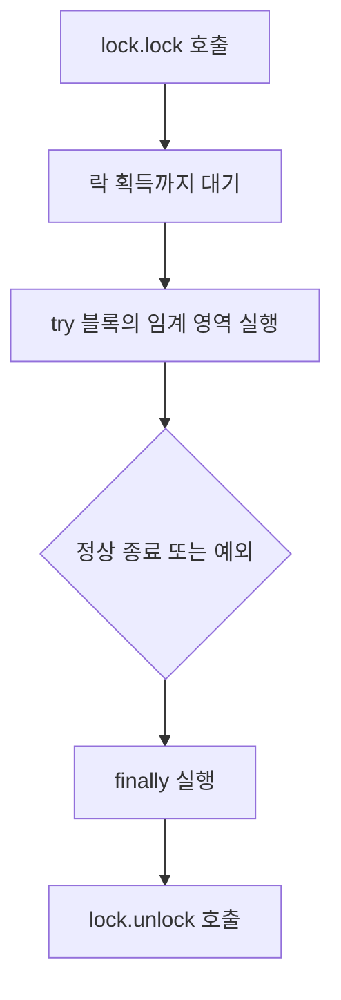
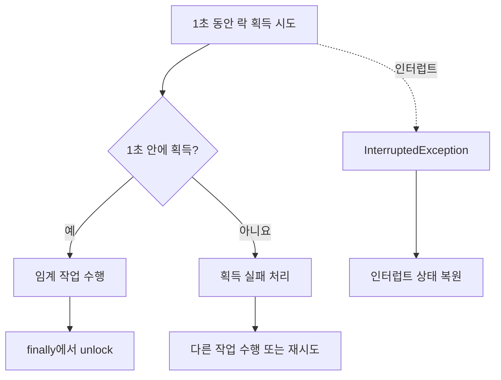
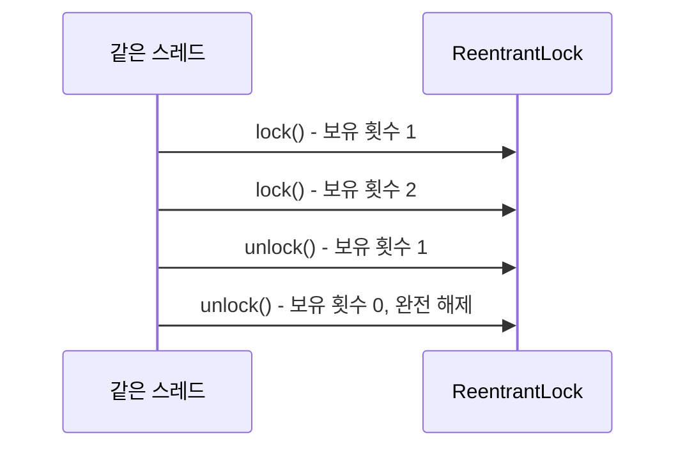
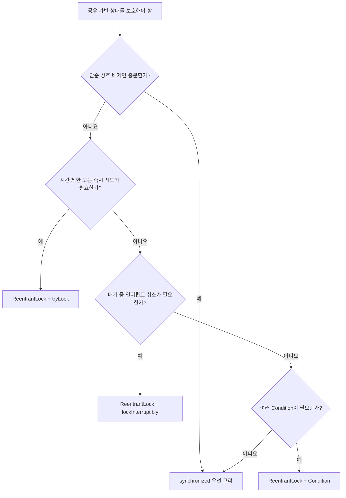

# Solution02: Java 동기화와 명시적 락

`Solution02.java`는 공유 카운터를 안전하게 증가시키는 두 방법과, 락 획득을 일정 시간만 기다리는 방법을 다룬다.

- `synchronized`
- `ReentrantLock`
- `tryLock(timeout, unit)`

## 1. 초심자용

### 왜 락이 필요한가?

여러 스레드가 하나의 `count`에 동시에 `count++`를 수행하면 읽기-수정-쓰기 단계가 서로 겹칠 수 있다. 락은 한 번에 한 스레드만 임계 영역에 들어가도록 제한한다.



| 용어 | 의미 | 코드 속 위치 |
|---|---|---|
| 임계 영역 | 동시에 실행하면 문제가 생겨 한 번에 하나만 실행해야 하는 영역 | `count++`가 포함된 `increment()` |
| 상호 배제 | 한 스레드가 임계 영역을 실행할 때 다른 스레드의 진입을 막는 것 | `synchronized`, `lock()` |
| 락 획득 | 임계 영역에 들어갈 권한을 얻는 것 | 메서드 진입 또는 `lock.lock()` |
| 락 해제 | 다른 스레드가 진입할 수 있도록 권한을 반환하는 것 | 메서드 종료 또는 `lock.unlock()` |
| 데드락 | 스레드들이 서로 필요한 락을 기다려 영원히 진행하지 못하는 상태 | 락 미해제 또는 잘못된 다중 락 순서로 발생 가능 |

### `synchronized` 방식

```java
public synchronized void increment() {
    count++;
}
```

인스턴스 `synchronized` 메서드는 현재 객체의 모니터 락을 사용한다. 같은 `SyncCounter` 객체에 대해 한 시점에 한 스레드만 `increment()`를 실행할 수 있다.



`synchronized`는 정상 종료와 예외 종료 모두에서 JVM이 락을 자동으로 해제한다.

### `ReentrantLock` 방식

```java
lock.lock();
try {
    count++;
} finally {
    lock.unlock();
}
```

`ReentrantLock`은 코드로 직접 획득하고 해제하는 명시적 락이다. 기능이 다양한 대신 해제를 개발자가 책임져야 한다.



`unlock()`을 `finally`에 두는 이유는 임계 영역에서 예외가 발생해도 반드시 락을 풀기 위해서다. 락을 풀지 않으면 이후 스레드가 계속 대기할 수 있다.

### `synchronized`와 `ReentrantLock` 비교

| 항목 | `synchronized` | `ReentrantLock` |
|---|---|---|
| 락 관리 | JVM이 자동 획득·해제 | 직접 `lock()`·`unlock()` 호출 |
| 예외 발생 시 해제 | 자동 | `finally`에서 직접 처리 |
| 일정 시간만 대기 | 지원하지 않음 | `tryLock(timeout, unit)` 지원 |
| 즉시 획득 시도 | 지원하지 않음 | `tryLock()` 지원 |
| 대기 중 인터럽트 | 일반 진입은 인터럽트로 취소 불가 | `lockInterruptibly()` 사용 가능 |
| 공정성 설정 | 직접 설정 불가 | 생성자에서 공정 락 선택 가능 |
| 조건 대기 | 객체별 단일 wait set | 여러 `Condition` 생성 가능 |
| 적합한 경우 | 단순한 상호 배제 | 세밀한 락 정책이 필요할 때 |

### `tryLock(1, TimeUnit.SECONDS)`

`runTryLock()`의 두 번째 작업은 락을 무한정 기다리지 않는다.

```java
boolean getLock = lock.tryLock(1, TimeUnit.SECONDS);
```



| 결과 | 반환값 또는 동작 | 후속 처리 |
|---|---|---|
| 제한 시간 안에 획득 | `true` | 작업 후 반드시 `unlock()` |
| 제한 시간 초과 | `false` | 대체 작업, 재시도, 실패 응답 등을 선택 |
| 대기 중 인터럽트 | `InterruptedException` | 현재 예제는 인터럽트 상태를 복원 |

### 재진입 가능한 락

`ReentrantLock`의 **reentrant**는 같은 스레드가 이미 가진 락을 다시 획득할 수 있다는 뜻이다. Java의 `synchronized`도 재진입 가능하다.



획득한 횟수만큼 해제해야 다른 스레드가 락을 얻을 수 있다.

### 예제 메서드 한눈에 보기

| 메서드 | 보호 방법 | 관찰할 내용 |
|---|---|---|
| `runSync()` | `synchronized` 메서드 | 두 스레드의 증가 작업이 객체 모니터로 직렬화됨 |
| `runLock()` | `ReentrantLock.lock()` | 명시적인 락 획득과 `finally` 해제 |
| `runTryLock()` | `tryLock(1, TimeUnit.SECONDS)` | 획득 성공과 시간 초과에 따라 흐름을 분기 |

현재 `main()`에서는 `runTryLock()`만 호출한다. 다른 예제를 실행하려면 해당 호출의 주석을 해제해야 한다.

## 2. 면접 대비용

### 핵심 질문과 답변

| 질문 | 답변 핵심 |
|---|---|
| `synchronized`는 무엇을 보장하는가? | 같은 모니터를 기준으로 상호 배제와 락 해제·획득 사이의 가시성을 보장한다. |
| 인스턴스 동기화 메서드는 무엇을 잠그는가? | 해당 메서드가 호출된 인스턴스의 모니터, 즉 일반적으로 `this`를 잠근다. |
| `static synchronized`는 무엇을 잠그는가? | 해당 클래스의 `Class` 객체 모니터를 잠근다. |
| `ReentrantLock`을 쓰는 이유는? | 시간 제한 획득, 인터럽트 가능한 획득, 공정성, 여러 조건 변수 등 고급 기능이 필요할 때 사용한다. |
| `unlock()`은 왜 `finally`에 두는가? | 예외나 조기 반환에도 락 해제를 보장하기 위해서다. |
| `tryLock()` 실패 후 `unlock()`해야 하는가? | 아니다. 현재 스레드가 획득한 경우에만 해제해야 한다. |
| `join()`과 락은 어떻게 다른가? | `join()`은 스레드 종료를 기다리고, 락은 공유 임계 영역의 동시 진입을 막는다. |
| `ReentrantLock`이 항상 더 빠른가? | 아니다. 성능은 JVM과 경합 패턴에 따라 달라지므로 기능·가독성·측정 결과로 선택해야 한다. |

### happens-before 관점

동기화는 단순히 동시에 들어가지 못하게 하는 것 이상의 의미가 있다.


| 동기화 관계 | 가시성 의미 |
|---|---|
| 모니터 unlock → 이후 같은 모니터 lock | 앞선 스레드의 변경이 뒤 스레드에 보인다. |
| `Lock.unlock()` → 이후 같은 `Lock.lock()` | 모니터 락과 같은 메모리 동기화 효과를 제공한다. |
| 스레드 작업 → 해당 스레드의 성공적인 `join()` 반환 | 종료된 스레드의 작업이 조인한 스레드에 보인다. |

### 락 선택 의사결정



### 실무에서 주의할 점

| 위험 | 원인 | 대응 |
|---|---|---|
| 데드락 | 여러 락을 서로 다른 순서로 획득 | 전역 락 순서 규칙, 타임아웃, 락 수 축소 |
| 기아 | 특정 스레드가 락을 계속 획득하지 못함 | 공정성 검토, 임계 영역 축소, 작업 구조 개선 |
| 라이브락 | 서로 양보하며 상태만 바꾸고 진전하지 못함 | 재시도 횟수 제한, 무작위 백오프 |
| 긴 대기 시간 | 임계 영역에서 느린 I/O나 긴 계산 수행 | 락 안의 작업 최소화 |
| 잘못된 해제 | 획득하지 않은 락을 해제하거나 해제를 누락 | 획득 성공 여부 확인, `try-finally` 사용 |
| 과도한 락 범위 | 필요 이상으로 많은 코드를 직렬화 | 공유 상태를 실제로 다루는 최소 범위만 보호 |

### 공정 락의 트레이드오프

```java
new ReentrantLock(true); // 공정성 정책 요청
```

| 비공정 락(기본값) | 공정 락 |
|---|---|
| 새 스레드가 먼저 락을 얻을 수 있음 | 오래 기다린 스레드에게 대체로 우선권 제공 |
| 일반적으로 처리량에 유리 | 대기 시간 편차 감소에 유리 |
| 기아 가능성을 더 주의해야 함 | 스케줄링 비용으로 처리량이 낮아질 수 있음 |

공정 락도 운영체제 스케줄링까지 포함한 절대적인 실행 순서를 보장하는 것은 아니다.

### 이 코드의 설계를 설명하는 답변 예시

> `SyncCounter`는 인스턴스 동기화 메서드를 사용해 같은 객체의 `increment()` 호출을 직렬화합니다. `LockCounter`는 같은 상호 배제를 `ReentrantLock`으로 구현하며, 예외가 발생해도 해제되도록 `unlock()`을 `finally`에 둡니다. `runTryLock()`은 최대 1초만 기다리고 실패 시 다른 흐름으로 전환하므로 무한 대기를 피할 수 있습니다. 두 방식 모두 같은 락을 사용하는 임계 영역에 대해 원자성과 가시성을 제공하지만, 명시적 락은 관리 책임이 더 큽니다.

### 추가 확인 문제

1. `SyncCounter` 객체를 스레드마다 따로 만들면 `synchronized`가 두 스레드 사이의 상호 배제를 제공하는가?
2. `tryLock()`이 `false`를 반환했는데 `unlock()`을 호출하면 어떻게 되는가?
3. 임계 영역 안에서 네트워크 호출을 피해야 하는 이유는 무엇인가?
4. `ReentrantLock`과 `synchronized` 중 어떤 것을 기본 선택으로 삼을 것인가?
5. 락을 사용하면 모든 종류의 데드락을 막을 수 있는가?

<details>
<summary>핵심 답안</summary>

1. 제공하지 않는다. 인스턴스마다 서로 다른 모니터를 사용하기 때문이다.
2. 현재 스레드가 락 소유자가 아니므로 `IllegalMonitorStateException`이 발생한다.
3. 락 보유 시간이 길어져 경합과 응답 지연이 커지고 장애가 임계 영역 전체로 전파될 수 있다.
4. 단순 상호 배제라면 자동 해제와 가독성이 좋은 `synchronized`를 우선 고려하고, 시간 제한·인터럽트·조건 변수 같은 기능이 필요하면 `ReentrantLock`을 선택한다.
5. 아니다. 여러 락의 획득 순서가 꼬이면 락을 사용하면서도 데드락이 발생할 수 있다.

</details>
