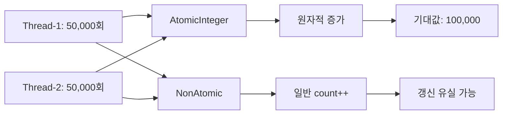
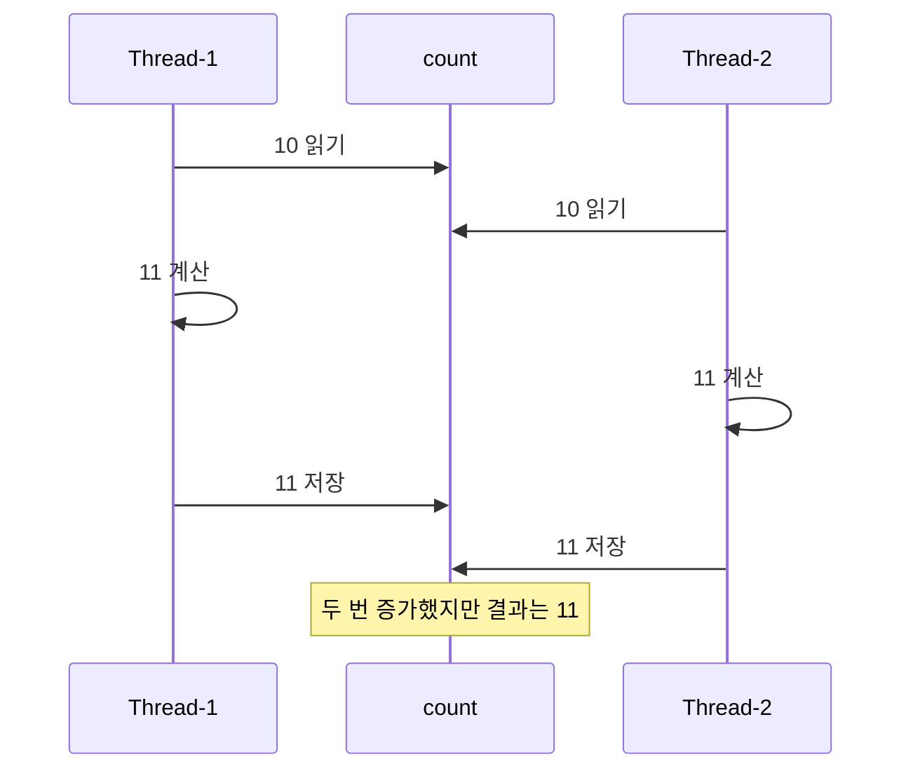
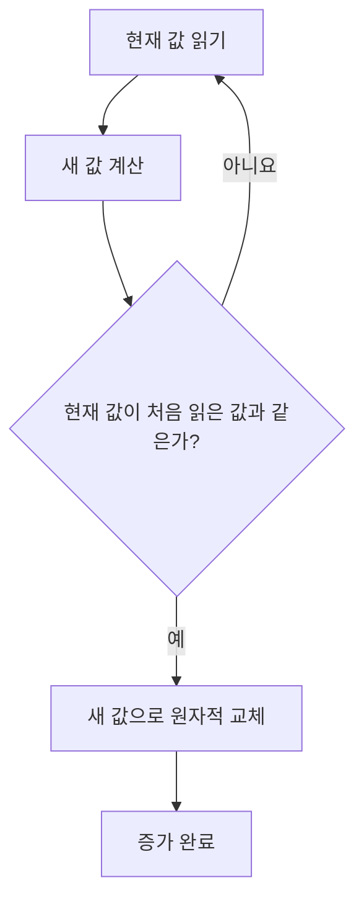
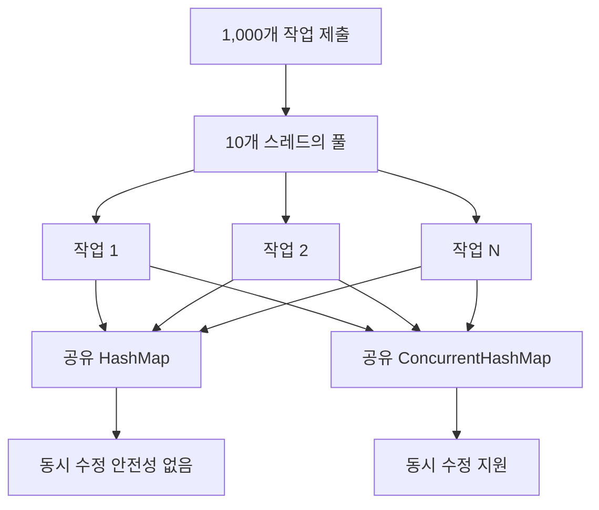
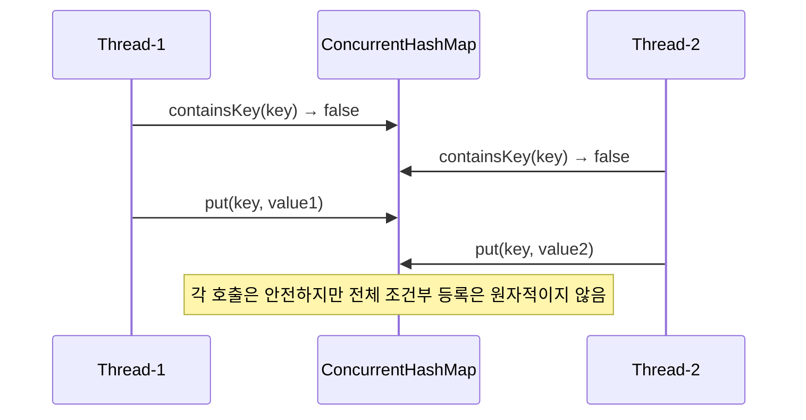
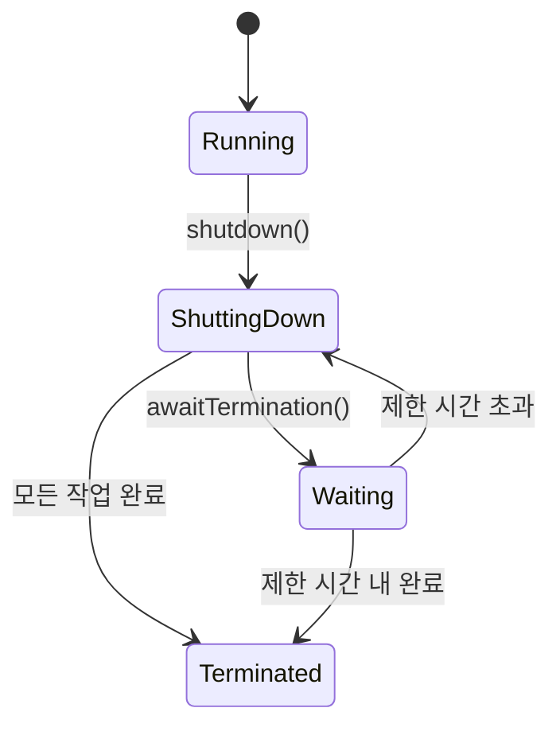
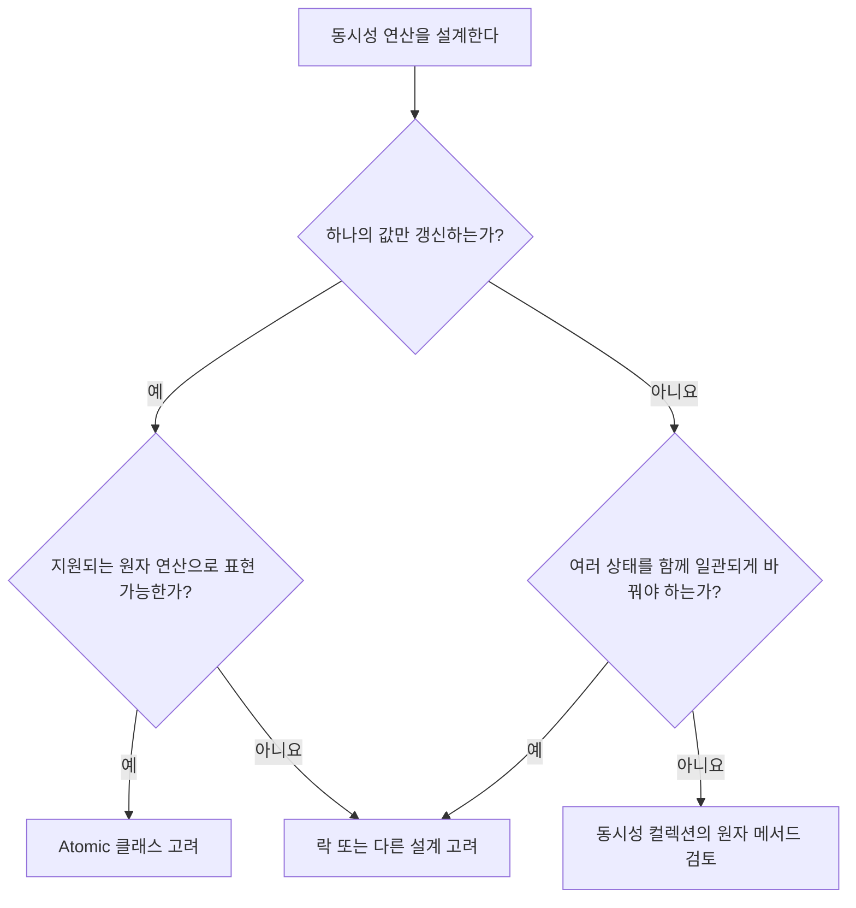

# Solution03: 원자 연산과 동시성 컬렉션

`Solution03.java`는 여러 스레드가 공유 데이터를 변경할 때 일반 객체와 동시성 도구의 차이를 비교한다.

- `int` 증가와 `AtomicInteger` 증가
- `HashMap`과 `ConcurrentHashMap`의 동시 쓰기
- `ExecutorService`를 이용한 작업 실행과 종료 대기

## 1. 초심자용

### 먼저 알아둘 용어

| 용어 | 쉬운 설명 | 코드 속 예시 |
|---|---|---|
| 원자성 | 하나의 연산이 중간에 나뉘지 않고 한 덩어리처럼 수행되는 성질 | `incrementAndGet()` |
| 공유 가변 상태 | 여러 스레드가 함께 접근하고 변경할 수 있는 데이터 | 카운터, `map`, `concurrentMap` |
| 스레드 안전 | 여러 스레드가 동시에 사용해도 객체의 상태가 깨지지 않는 성질 | `AtomicInteger`, `ConcurrentHashMap` |
| 갱신 유실 | 여러 변경이 겹쳐 일부 결과가 사라지는 현상 | `NonAtomic.count++` |
| 동시성 컬렉션 | 동시 접근을 고려해 설계된 컬렉션 | `ConcurrentHashMap` |
| CAS | 현재 값이 예상값과 같을 때만 새 값으로 바꾸는 원자적 연산 | 원자 클래스 구현의 핵심 개념 |

### 일반 카운터와 원자 카운터

`runAtomic()`은 두 스레드가 각각 50,000번씩 두 카운터를 증가시킨다.

```java
atomicCount.incrementAndGet();
nonAtomicCount.increment();
```



| 항목 | `AtomicInteger` | `NonAtomic`의 `int` |
|---|---|---|
| 증가 코드 | `incrementAndGet()` | `count++` |
| 증가 연산의 원자성 | 보장 | 보장하지 않음 |
| 별도 락 코드 | 필요 없음 | 안전하게 하려면 동기화 필요 |
| 여러 스레드의 변경 가시성 | 원자 클래스의 규칙으로 보장 | 동기화 없이는 일반적으로 보장하지 않음 |
| 예제의 최종값 | 100,000 기대 | 100,000보다 작을 수 있음 |

### 왜 `count++`는 안전하지 않은가?

`count++`는 한 줄이지만 실제 개념은 세 단계다.



두 스레드가 같은 이전 값을 읽으면 마지막 저장이 앞선 저장을 덮는다. 이를 갱신 유실이라고 한다.

### `AtomicInteger`와 CAS

원자 클래스는 단순한 읽기-변경-쓰기를 하나의 원자적 갱신으로 제공한다. 대표적인 내부 원리가 CAS(Compare-And-Set)다.



CAS는 다른 스레드가 값을 먼저 바꾸면 갱신을 실패시키고 다시 시도한다. 일반적인 단순 카운터에서는 명시적인 락 없이 안전한 증가를 구현할 수 있다.

> `AtomicInteger`가 모든 동시성 문제를 해결하지는 않는다. 여러 변수의 값을 하나의 규칙으로 함께 변경해야 한다면 더 넓은 임계 영역과 동기화 전략이 필요할 수 있다.

### `HashMap`과 `ConcurrentHashMap`

`runMap()`은 10개 스레드가 총 1,000개의 서로 다른 키를 두 맵에 저장한다.



| 항목 | `HashMap` | `ConcurrentHashMap` |
|---|---|---|
| 기본 목적 | 단일 스레드 또는 외부 동기화 환경 | 여러 스레드의 동시 접근 |
| 동시 `put()` | 안전하지 않음 | 안전하게 지원 |
| `null` 키·값 | 허용 | 허용하지 않음 |
| 반복 중 변경 | 일반적으로 fail-fast 가능 | 약한 일관성의 반복자 제공 |
| 전체 맵 잠금 | 자체 제공하지 않음 | 내부적으로 동시성을 높이는 세분화된 제어 사용 |
| 적합한 상황 | 스레드 한정 데이터 | 공유 캐시, 공유 상태 저장소 등 |

서로 다른 키를 넣더라도 `HashMap` 내부 구조 자체가 공유되므로 안전하다고 볼 수 없다. 키가 다르다는 사실과 컬렉션 내부 변경이 스레드 안전하다는 것은 별개다.

### 단일 메서드 안전성과 복합 연산

`ConcurrentHashMap`의 각 메서드는 스레드 안전하지만 여러 메서드를 조합하면 전체 로직이 원자적이지 않을 수 있다.

```java
if (!map.containsKey(key)) {
    map.put(key, value);
}
```



이때는 `putIfAbsent()`, `computeIfAbsent()`, `compute()` 같은 복합 연산용 메서드를 고려한다.

| 의도 | 권장 메서드 |
|---|---|
| 키가 없을 때만 값 등록 | `putIfAbsent()` |
| 키가 없을 때 계산해서 등록 | `computeIfAbsent()` |
| 기존 값에 따라 새 값 계산 | `compute()` |
| 값 누적 | `merge()` |

### 작업 제출과 종료 대기

```java
executor.shutdown();
executor.awaitTermination(5, TimeUnit.SECONDS);
```

`shutdown()`은 새 작업 접수를 중단하고 이미 제출된 작업은 처리한다. `awaitTermination()`은 지정 시간 동안 종료를 기다린다.



현재 코드는 `awaitTermination()`의 반환값을 사용하지 않는다. 따라서 5초 안에 모든 작업이 끝났는지 확인하지 않은 채 맵 크기를 출력할 가능성이 있다.

## 2. 면접 대비용

### 핵심 질문과 답변

| 질문 | 답변 핵심 |
|---|---|
| `AtomicInteger`는 왜 스레드 안전한가? | 원자적 읽기·갱신 연산과 메모리 가시성 규칙을 제공한다. 일반적으로 CAS를 활용한다. |
| CAS란 무엇인가? | 메모리 값이 예상값과 같을 때만 새 값으로 교체하는 원자적 연산이다. 실패하면 재시도할 수 있다. |
| CAS의 단점은? | 경합이 심하면 반복 재시도로 CPU를 많이 사용할 수 있고, 복잡한 복합 상태 제어에는 적합하지 않을 수 있다. |
| `volatile int count`에 `count++`를 사용하면 안전한가? | 아니다. `volatile`은 가시성을 제공하지만 읽기-수정-쓰기 전체의 원자성을 보장하지 않는다. |
| 키가 모두 달라도 `HashMap` 동시 쓰기가 위험한 이유는? | 버킷과 크기 등 맵의 내부 가변 구조를 여러 스레드가 함께 수정하기 때문이다. |
| `ConcurrentHashMap`이면 모든 복합 로직이 원자적인가? | 아니다. 단일 메서드의 보장 범위와 여러 호출을 조합한 로직의 원자성을 구분해야 한다. |
| `Collections.synchronizedMap()`과 차이는? | 동기화 래퍼는 일반적으로 공통 뮤텍스를 사용하고, `ConcurrentHashMap`은 더 높은 동시성과 전용 원자 연산을 제공한다. |

### 락 기반과 CAS 기반 비교

| 항목 | 락 기반 | CAS 기반 원자 연산 |
|---|---|---|
| 대기 방식 | 락을 얻을 때까지 대기·차단 가능 | 실패 시 재시도하는 비차단 방식에 활용 |
| 적합한 범위 | 여러 연산과 상태를 묶는 임계 영역 | 단일 값의 단순 원자 갱신 |
| 경합이 낮을 때 | 관리 비용이 있을 수 있음 | 빠르고 간결한 경우가 많음 |
| 경합이 높을 때 | 문맥 교환과 대기 비용 가능 | 재시도 비용 증가 가능 |
| 구현 난이도 | 락 범위와 순서를 설계해야 함 | 제공되는 원자 클래스 사용은 간단하지만 직접 알고리즘 구현은 어려움 |
| 대표 도구 | `synchronized`, `ReentrantLock` | `AtomicInteger`, `AtomicReference` |

### 원자성의 범위를 확인하는 질문



예를 들어 `AtomicInteger` 두 개를 각각 안전하게 변경해도 두 값 사이의 불변식까지 자동으로 보장되지는 않는다.

### `ConcurrentHashMap` 면접 포인트

| 주제 | 설명 |
|---|---|
| 동시 읽기 | 여러 스레드가 효율적으로 읽을 수 있도록 설계됐다. |
| 동시 쓰기 | 전체 맵을 항상 하나의 락으로 막지 않고 높은 동시성을 제공한다. |
| 약한 일관성 반복자 | 반복 중 변경을 허용하며 특정 시점의 완전한 스냅샷을 보장하지 않는다. |
| `null` 미허용 | 조회 결과 `null`을 값 없음으로 명확히 해석할 수 있게 한다. |
| 복합 원자 연산 | `compute`, `merge`, `putIfAbsent` 등을 제공한다. |

### 이 코드를 설명하는 답변 예시

> `runAtomic()`은 일반 `count++`의 갱신 유실과 `AtomicInteger`의 원자적 증가를 비교합니다. `runMap()`은 여러 풀 스레드가 하나의 `HashMap`과 `ConcurrentHashMap`에 동시에 쓰도록 해 컬렉션의 스레드 안전성 차이를 보여 줍니다. 다만 `ConcurrentHashMap`도 여러 메서드 호출을 조합한 로직 전체를 자동으로 원자화하지 않으므로, 조건부 등록이나 누적에는 `putIfAbsent`, `compute`, `merge` 같은 전용 메서드를 사용해야 합니다.

### 추가 확인 문제

1. `AtomicInteger.get()` 후 계산하고 `set()`하면 전체 연산이 항상 원자적인가?
2. `volatile`이 `count++`의 갱신 유실을 막지 못하는 이유는 무엇인가?
3. `ConcurrentHashMap`에 `null`을 허용하지 않는 이유는 무엇인가?
4. `awaitTermination()`이 `false`를 반환하면 현재 코드에는 어떤 문제가 생길 수 있는가?
5. 여러 계좌의 잔액을 동시에 변경하는 작업에 `AtomicInteger` 하나만으로 충분한가?

<details>
<summary>핵심 답안</summary>

1. 아니다. `get()`과 `set()`은 각각 원자적이어도 둘 사이에 다른 스레드가 개입할 수 있다.
2. `volatile`은 최신 값의 가시성을 보장하지만 읽기-수정-쓰기 복합 연산을 하나로 묶지 않는다.
3. 동시 조회에서 `null`이 값 부재인지 실제 저장값인지 모호해지는 것을 피하기 위해서다.
4. 작업이 끝나기 전에 맵을 출력해 크기와 내용이 최종 결과가 아닐 수 있다.
5. 일반적으로 부족하다. 여러 상태를 하나의 트랜잭션처럼 변경하려면 더 넓은 동기화나 설계가 필요하다.

</details>
