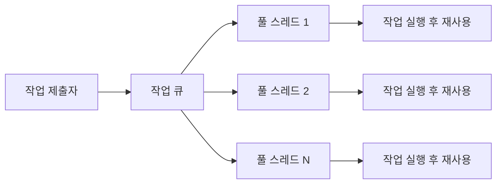
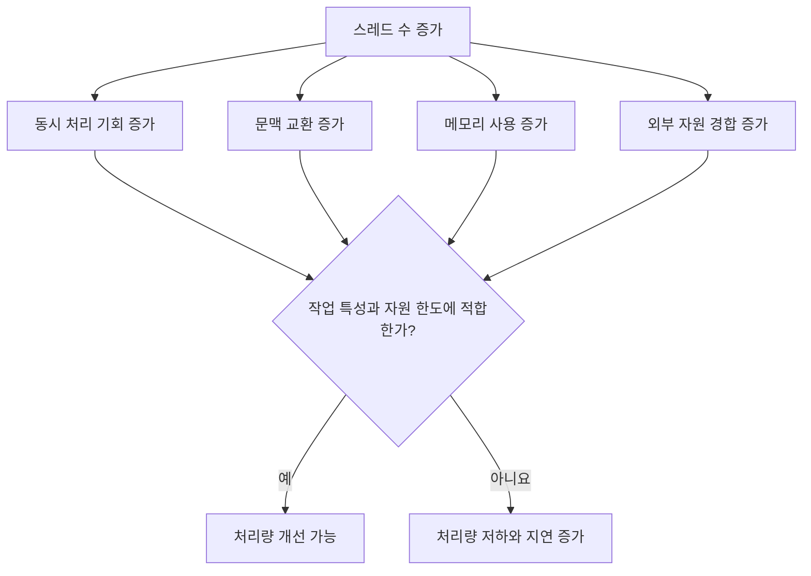
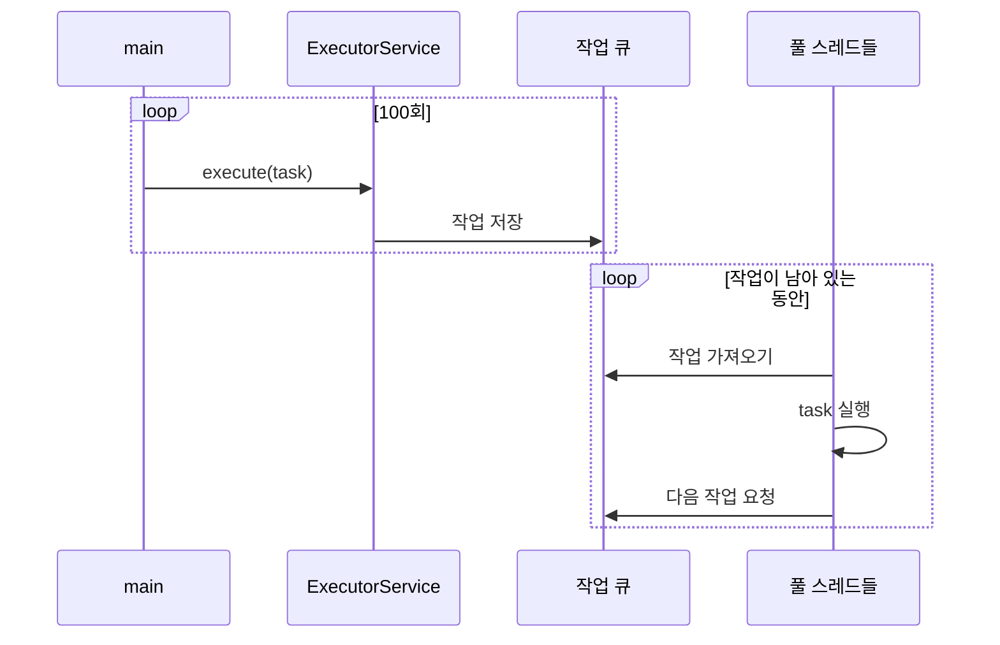
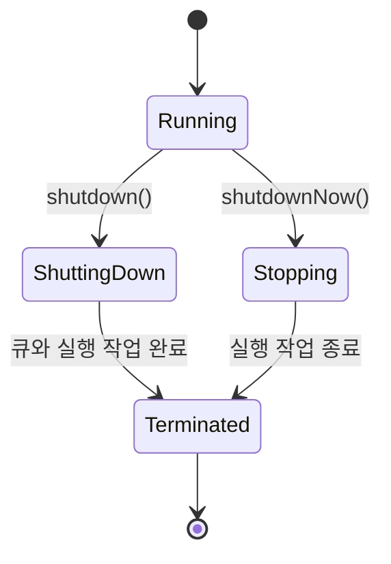
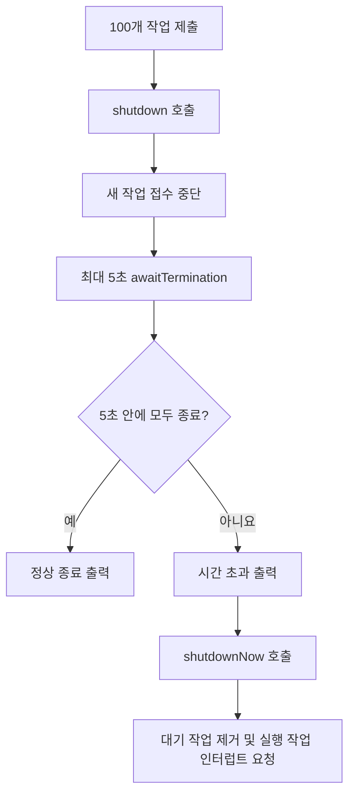
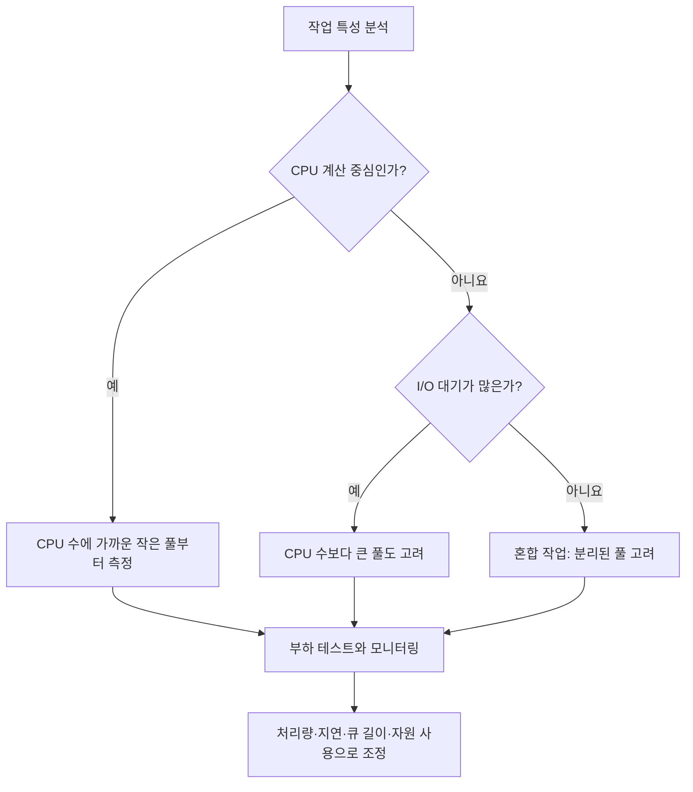
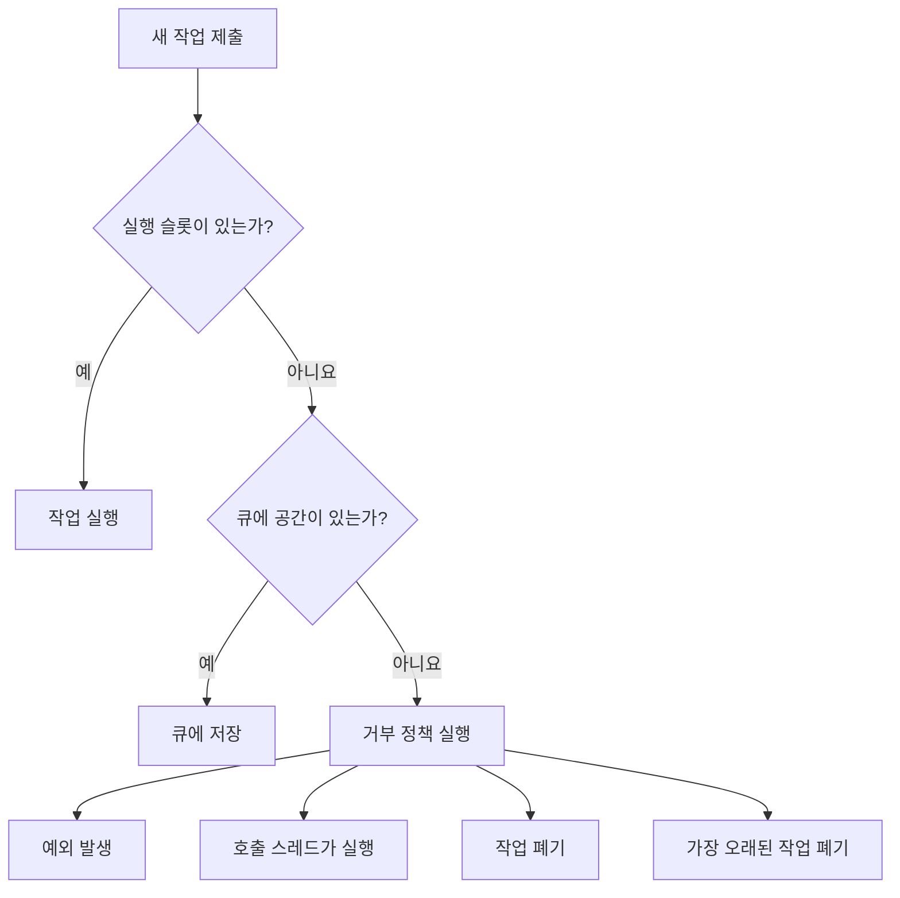
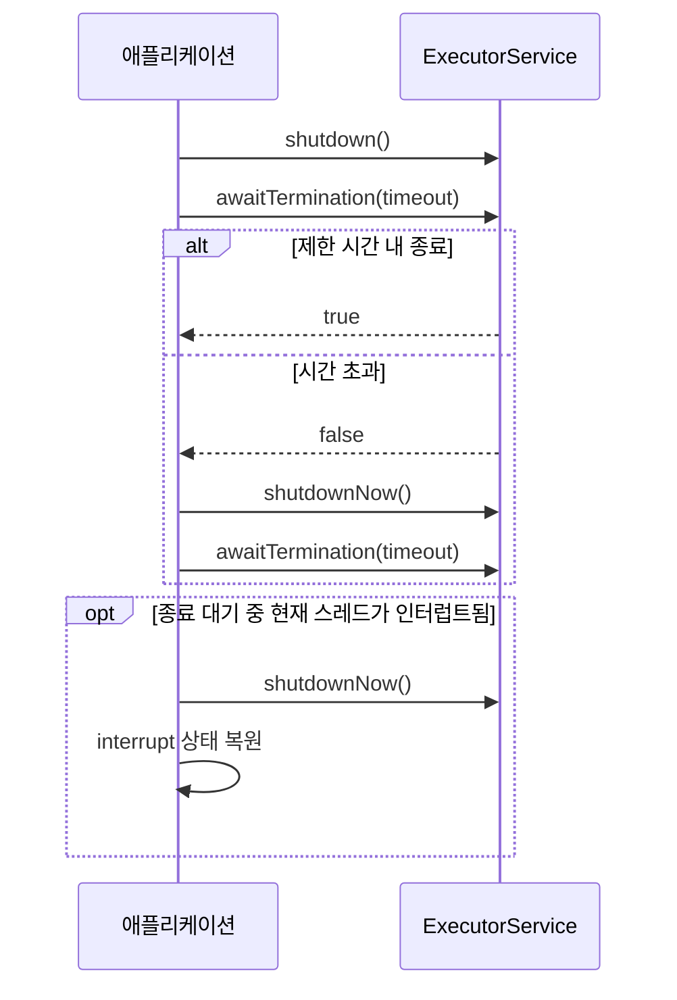

# Solution04: 스레드 풀과 ExecutorService 생명주기

`Solution04.java`는 CPU 개수를 바탕으로 고정 크기 스레드 풀을 만들고, 작업 제출 후 정상 종료를 기다리다가 제한 시간을 넘으면 강제 종료를 요청하는 흐름을 다룬다.

## 1. 초심자용

### 풀(Pool)이란?

풀은 생성 비용이 크거나 개수를 제한해야 하는 자원을 미리 준비하고 재사용하는 방식이다.

| 풀 종류 | 재사용 대상 | 사용하는 이유 |
|---|---|---|
| 스레드 풀 | 작업을 실행하는 스레드 | 생성·종료 비용 절감, 동시 실행 수 제한 |
| 커넥션 풀 | 데이터베이스 연결 | 연결 비용 절감, DB 연결 수 제한 |
| 객체 풀 | 특정 객체 | 생성 비용 절감이 실제로 필요한 특수한 경우 |



새 작업마다 스레드를 만드는 대신 정해진 수의 스레드가 큐에서 작업을 가져와 반복 실행한다.

### 왜 스레드 수를 제한하는가?

스레드를 많이 만든다고 CPU 작업이 무조건 빨라지지는 않는다.

| 자원·비용 | 스레드가 너무 많을 때의 영향 |
|---|---|
| CPU | 실행할 스레드를 자주 바꾸는 문맥 교환 증가 |
| 메모리 | 각 스레드의 스택과 관리 정보가 메모리 사용 |
| 스케줄러 | 실행 가능 스레드 관리 비용 증가 |
| 외부 시스템 | DB·API에 과도한 동시 요청 발생 가능 |
| 응답 시간 | 큐 적체와 자원 경합으로 오히려 지연 가능 |



### 사용 가능한 CPU 개수

```java
int cpuCount = Runtime.getRuntime().availableProcessors();
```

이 값은 JVM이 사용할 수 있다고 인식하는 논리 프로세서 수다. 물리 코어 수와 항상 같지는 않으며, 컨테이너나 실행 환경의 CPU 제한에 따라 달라질 수 있다.

현재 코드는 다음 크기의 풀을 만든다.

```java
Executors.newFixedThreadPool(cpuCount / 2);
```

| 표현 | 의미 |
|---|---|
| `newFixedThreadPool(n)` | 최대 `n`개의 작업을 동시에 실행하는 고정 크기 풀 생성 |
| `cpuCount / 2` | 감지된 CPU 수의 절반을 풀 크기로 선택 |
| `execute(task)` | 반환 결과가 없는 `Runnable` 작업 제출 |

> 풀 크기는 단순 공식으로 항상 결정할 수 없다. 작업이 CPU 계산 중심인지, I/O 대기 중심인지, 외부 시스템이 얼마만큼의 부하를 견디는지 함께 봐야 한다.

### 고정 스레드 풀의 작업 흐름

현재 예제는 100개 작업을 제출한다. 풀 스레드가 4개라면 한 번에 최대 4개가 실행되고 나머지는 큐에서 기다린다.



각 작업은 `sleep(1000)`으로 약 1초 동안 쉬기 때문에 풀 크기에 따라 전체 완료 시간이 달라진다.

### `ExecutorService` 종료가 필요한 이유

풀의 작업 스레드는 일반적으로 애플리케이션 종료를 막을 수 있다. 작업을 모두 제출한 뒤에는 종료 정책을 명시해야 한다.



| 메서드 | 새 작업 접수 | 대기 중 작업 | 실행 중 작업 | 즉시 종료 보장 |
|---|---|---|---|---|
| `shutdown()` | 거부 | 계속 실행 | 계속 실행 | 아니요 |
| `shutdownNow()` | 거부 | 큐에서 제거해 목록으로 반환 | 인터럽트 요청 | 아니요 |
| `awaitTermination()` | 상태 변경 없음 | 상태 변경 없음 | 종료될 때까지 제한 시간 대기 | 아니요 |

### 현재 코드의 종료 절차



`shutdownNow()`라는 이름과 달리 스레드를 강제로 즉시 죽이지 않는다. 실행 중인 작업에 인터럽트를 요청하며, 작업 코드가 인터럽트에 협조해야 빨리 끝날 수 있다.

### 인터럽트 협조

예제의 작업은 다음 패턴을 사용한다.

```java
try {
    Thread.sleep(1000);
} catch (InterruptedException e) {
    Thread.currentThread().interrupt();
}
```

| 단계 | 의미 |
|---|---|
| `shutdownNow()` | 풀 스레드에 인터럽트 요청 |
| `sleep()` | 인터럽트를 감지하고 `InterruptedException` 발생 |
| `interrupt()` 재호출 | 지워진 인터럽트 상태 복원 |
| 작업 반환 | 현재 람다의 끝에 도달해 작업 종료 |

실제 반복 작업에서는 상태를 복원한 뒤 반복문을 빠져나가거나 메서드를 반환하는 등 명시적인 종료 흐름이 필요하다.

### `execute()`와 `submit()`

| 항목 | `execute()` | `submit()` |
|---|---|---|
| 선언 위치 | `Executor` | `ExecutorService` |
| 반환값 | 없음 | `Future` |
| 결과 조회 | 불가 | `Future.get()` 사용 가능 |
| 작업 취소 | 직접 핸들 없음 | `Future.cancel()` 가능 |
| 작업 예외 확인 | 스레드의 예외 처리 흐름으로 전달 | `Future.get()`에서 `ExecutionException`으로 확인 가능 |
| 적합한 경우 | 결과가 필요 없는 단순 명령 | 결과·완료·취소·예외 추적 필요 |

## 2. 면접 대비용

### 핵심 질문과 답변

| 질문 | 답변 핵심 |
|---|---|
| 스레드 풀을 사용하는 이유는? | 스레드 생성 비용을 줄이고 동시 실행 수를 제한하며 작업 제출과 실행을 분리하기 위해서다. |
| `shutdown()`과 `shutdownNow()`의 차이는? | 전자는 제출된 작업의 완료를 기다리는 정상 종료이고, 후자는 대기 작업을 제거하고 실행 작업에 인터럽트를 요청한다. |
| `shutdownNow()`는 즉시 종료를 보장하는가? | 아니다. Java는 안전한 강제 스레드 종료를 제공하지 않으며 작업이 인터럽트에 협조해야 한다. |
| `awaitTermination()`이 풀을 종료하는가? | 아니다. 종료 요청 후 완료를 기다리는 메서드이므로 보통 먼저 `shutdown()`을 호출한다. |
| CPU 코어 수만큼 스레드를 만들면 항상 최적인가? | 아니다. CPU 중심·I/O 중심 여부, 대기 시간, 외부 자원 한도, 목표 처리량을 고려하고 측정해야 한다. |
| `execute()`와 `submit()`의 차이는? | `submit()`은 `Future`를 반환해 결과·취소·예외를 추적할 수 있다. |
| 고정 스레드 풀의 위험은? | 기본 구현의 작업 큐가 사실상 무제한이어서 생산 속도가 소비 속도보다 빠르면 메모리 문제가 생길 수 있다. |

### 풀 크기 결정의 기본 관점



| 작업 유형 | 특징 | 풀 크기 접근 |
|---|---|---|
| CPU 중심 | 대부분 계산하며 대기가 적음 | 사용 가능 CPU 수 근처에서 시작 |
| I/O 중심 | 네트워크·디스크 대기가 많음 | 대기 비율을 고려해 더 크게 설정 가능 |
| 혼합형 | 계산과 대기가 함께 존재 | 작업 유형별 풀 분리 검토 |
| 외부 제한형 | DB 커넥션, API 할당량 등에 제한 | 가장 좁은 외부 자원 한도를 우선 고려 |

공식은 출발점일 뿐이다. 실제 값은 운영 환경과 부하 테스트 결과로 정해야 한다.

### `newFixedThreadPool()`의 숨은 특성

`Executors.newFixedThreadPool(n)`은 사용하기 쉽지만 작업 큐가 사실상 무제한이다.


운영 환경에서는 `ThreadPoolExecutor`로 다음 항목을 명시하는 방식을 고려한다.

| 설정 | 역할 |
|---|---|
| core pool size | 기본적으로 유지할 스레드 수 |
| maximum pool size | 허용할 최대 스레드 수 |
| work queue | 대기 작업의 저장 방식과 용량 |
| keep-alive time | 여분 스레드를 유지할 시간 |
| thread factory | 스레드 이름, 우선순위, 예외 처리 설정 |
| rejection handler | 풀과 큐가 모두 찼을 때의 거부 정책 |

### 작업 거부 정책



| 기본 제공 정책 | 동작 |
|---|---|
| `AbortPolicy` | `RejectedExecutionException` 발생 |
| `CallerRunsPolicy` | 제출한 스레드가 직접 실행해 생산 속도를 늦춤 |
| `DiscardPolicy` | 새 작업을 조용히 폐기 |
| `DiscardOldestPolicy` | 큐의 가장 오래된 작업을 버리고 다시 제출 시도 |

### 권장 종료 패턴

일반적인 종료 정책은 정상 종료를 먼저 시도하고, 제한 시간을 넘으면 강제 종료를 요청한 뒤 다시 종료를 확인하는 구조다.



현재 예제는 `catch (Exception e)`로 모든 예외를 포괄한다. 면접이나 실무에서는 `InterruptedException`을 구체적으로 처리하고 현재 스레드의 인터럽트 상태를 복원하는 이유를 설명할 수 있어야 한다.

### 이 코드를 설명하는 답변 예시

> 이 코드는 사용 가능한 논리 프로세서 수를 조회해 절반 크기의 고정 스레드 풀을 만들고 100개의 작업을 제출합니다. 제출 후 `shutdown()`으로 신규 작업을 차단하고, `awaitTermination()`으로 최대 5초간 정상 종료를 기다립니다. 시간 초과 시 `shutdownNow()`를 호출하지만 이는 강제 종료가 아니라 인터럽트 요청입니다. 따라서 작업이 인터럽트에 협조해야 하며, 실제 풀 크기는 CPU 수뿐 아니라 작업의 대기 비율, 큐 길이, 외부 자원 한도를 측정해 결정해야 합니다.

### 추가 확인 문제

1. `shutdown()` 직후 실행 중인 작업은 중단되는가?
2. `awaitTermination()`을 `shutdown()` 전에 호출하면 어떤 의미인가?
3. `shutdownNow()`가 실행 중인 무한 반복 작업을 끝내지 못할 수 있는 이유는 무엇인가?
4. CPU 중심 작업과 I/O 중심 작업의 풀 크기를 다르게 잡는 이유는 무엇인가?
5. `newFixedThreadPool()`에 작업이 계속 쌓일 때 어떤 위험이 있는가?
6. 작업 결과와 예외를 확인해야 할 때 `execute()` 대신 무엇을 사용할 수 있는가?

<details>
<summary>핵심 답안</summary>

1. 아니다. 이미 제출된 작업은 계속 처리한다.
2. 종료 요청이 없으므로 일반적으로 제한 시간 동안 기다린 뒤 `false`를 반환한다.
3. 작업이 인터럽트 상태를 확인하지 않거나 인터럽트를 무시하면 계속 실행할 수 있다.
4. I/O 중심 작업은 대기 중 CPU를 사용하지 않으므로 더 많은 스레드로 자원 활용도를 높일 여지가 있다.
5. 무제한에 가까운 큐가 커져 메모리 사용과 대기 시간이 증가하고 OOM으로 이어질 수 있다.
6. `submit()`으로 `Future`를 받아 결과, 완료, 취소, 예외를 추적할 수 있다.

</details>
