# Solution05: CompletableFuture 비동기 파이프라인

`Solution05.java`는 `CompletableFuture`로 비동기 작업을 시작하고, 결과 변환·예외 복구·최종 소비 단계를 연결하는 방법을 다룬다.

```java
supplyAsync(...)
    .thenApply(...)
    .exceptionally(...)
    .thenAccept(...);
```

## 1. 초심자용

### 동기와 비동기

| 구분 | 동기 처리 | 비동기 처리 |
|---|---|---|
| 작업 요청 후 | 작업이 끝날 때까지 현재 흐름이 기다림 | 작업 완료를 기다리지 않고 다음 흐름 진행 가능 |
| 결과 전달 | 메서드 반환값으로 즉시 받음 | 미래에 완료될 객체나 콜백으로 받음 |
| 코드 예시 | 일반 메서드 호출 | `CompletableFuture.supplyAsync()` |
| 적합한 상황 | 단순하고 빠른 순차 작업 | 독립 작업, I/O 대기, 여러 작업 조합 |

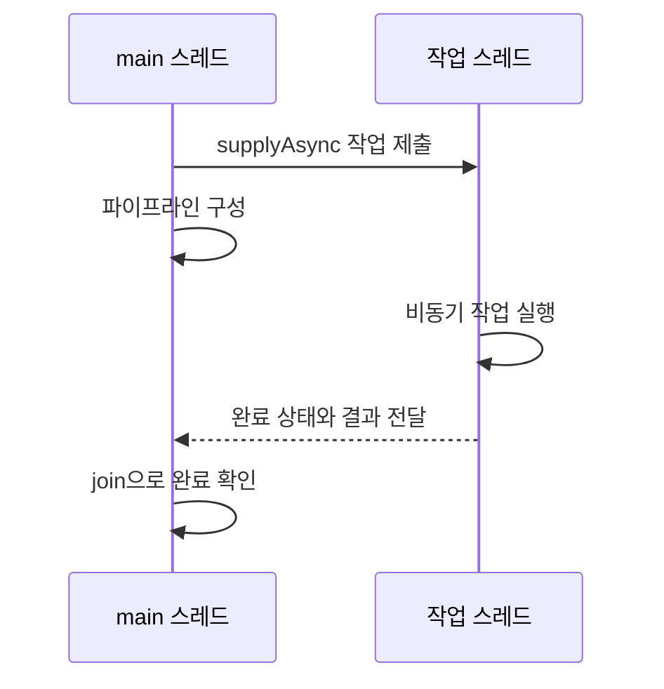

비동기는 반드시 병렬이라는 뜻이 아니다.

- **비동기**는 작업 완료를 기다리는 방식을 설명한다.
- **병렬**은 여러 작업이 실제 같은 시간대에 실행되는지를 설명한다.
- 비동기 작업도 실행 환경에 따라 순차적으로 처리될 수 있다.

### `CompletableFuture`란?

`CompletableFuture<T>`는 미래에 완료될 작업의 결과 `T`를 나타낸다. 정상 결과뿐 아니라 예외와 취소 상태도 표현할 수 있다.

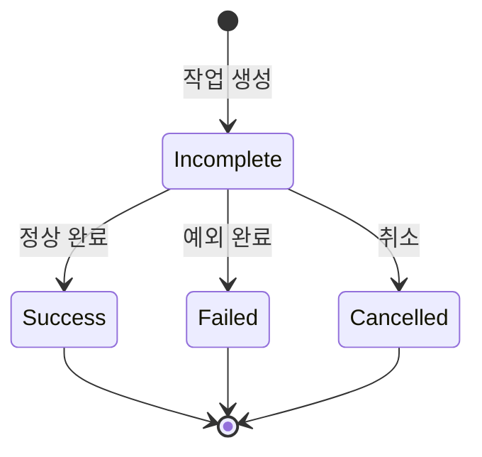

| 상태 | 의미 | 현재 코드의 가능성 |
|---|---|---|
| 미완료 | 작업이 아직 실행 중 | `sleep(1000)` 동안 |
| 정상 완료 | 결과값을 가지고 끝남 | 예외가 없다면 문자열 반환 |
| 예외 완료 | 예외를 가지고 끝남 | `RuntimeException("Error")` 발생 |
| 취소 | 작업 취소 상태 | 현재 코드에는 취소 호출 없음 |

### 제네릭 타입의 흐름

각 단계가 반환하는 값에 따라 `CompletableFuture`의 제네릭 타입이 달라진다.


최종 변수의 타입이 `CompletableFuture<Void>`인 이유는 `thenAccept()`가 결과를 소비만 하고 새 값을 반환하지 않기 때문이다.

### `supplyAsync()`: 값을 만드는 비동기 작업

```java
CompletableFuture.supplyAsync(() -> {
    return "Hello!";
})
```

| 항목 | 설명 |
|---|---|
| 입력 | 값을 반환하는 `Supplier<T>` |
| 출력 | `CompletableFuture<T>` |
| 실행 | 별도 실행자에서 비동기로 수행 |
| 현재 예제의 결과 타입 | `String` |

현재 코드는 별도 `Executor`를 전달하지 않으므로 일반적으로 `ForkJoinPool.commonPool()`을 사용한다.

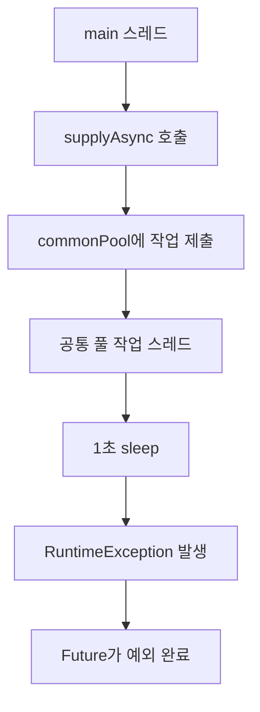

### 단계별 메서드 비교

| 메서드 | 입력 | 반환 | 용도 |
|---|---|---|---|
| `supplyAsync()` | 값을 만드는 함수 | `CompletableFuture<T>` | 비동기 작업 시작 |
| `thenApply()` | 이전 결과 `T` | 새 결과 `U` | 값 변환 |
| `thenAccept()` | 이전 결과 `T` | 반환값 없음 | 결과 소비 |
| `thenRun()` | 이전 결과를 받지 않음 | 반환값 없음 | 완료 후 별도 동작 |
| `exceptionally()` | 발생한 예외 | 복구 결과 `T` | 예외를 정상값으로 복구 |
| `join()` | 없음 | 최종 결과 또는 예외 | 완료까지 현재 스레드 대기 |

### `thenApply()`: 결과 변환

```java
.thenApply(s -> {
    System.out.println(s);
    return s;
})
```

`thenApply()`는 앞 단계가 **정상 완료**했을 때만 실행된다. 이전 결과를 입력받아 새로운 결과로 바꾼다.

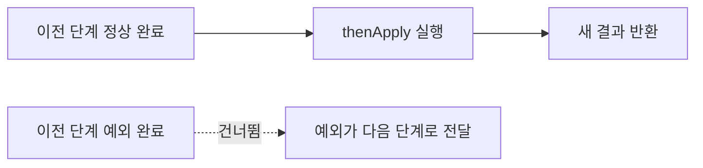

현재 `supplyAsync()` 내부에서 항상 `RuntimeException`이 발생하므로 `thenApply()`의 `System.out.println(s)`는 실행되지 않는다.

### `exceptionally()`: 예외 복구

```java
.exceptionally(e -> "Error : " + e.getMessage())
```

`exceptionally()`는 앞선 파이프라인이 예외로 완료됐을 때 호출된다. 예외를 받아 원래 결과 타입과 같은 복구값을 반환한다.

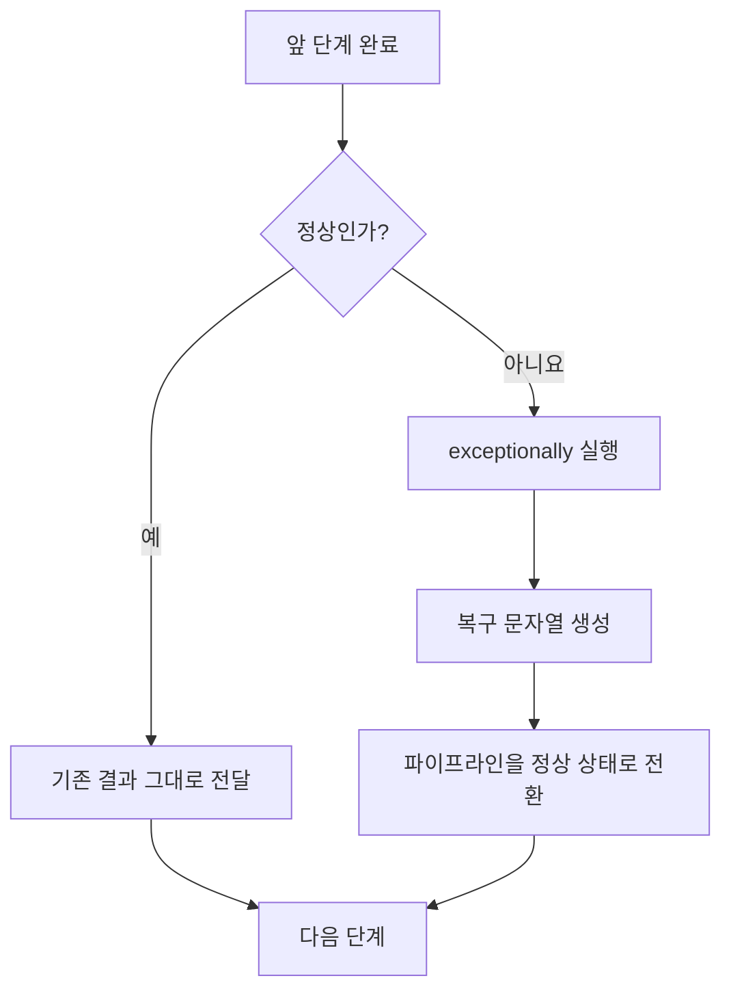

예외 처리 위치가 중요하다.

| 배치 | 처리 범위 |
|---|---|
| `supplyAsync().exceptionally(...)` | 주로 시작 작업에서 발생한 예외 |
| `supplyAsync().thenApply(...).exceptionally(...)` | 시작 작업과 `thenApply()`에서 발생한 예외 |
| 파이프라인 마지막의 `exceptionally(...)` | 앞선 모든 연결 단계의 예외 |

### 현재 코드의 실제 예외 흐름

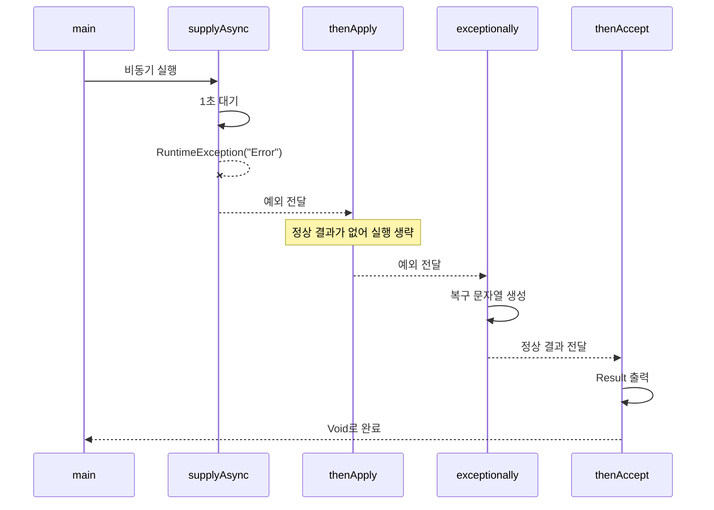

현재 코드의 출력 문자열에는 예외가 `CompletionException`으로 감싸져 보일 수 있다. 비동기 단계의 예외는 완료 상태를 전달하기 위해 래핑될 수 있기 때문이다.

### `thenAccept()`: 결과 소비

```java
.thenAccept(s -> System.out.println("Result : " + s));
```

`thenAccept()`는 결과를 받아 사용하지만 값을 반환하지 않는다. 따라서 이후 결과 타입은 `Void`다.

| 메서드 | 이전 결과 사용 | 새 결과 반환 | 함수형 인터페이스 |
|---|---:|---:|---|
| `thenApply()` | O | O | `Function<T, U>` |
| `thenAccept()` | O | X | `Consumer<T>` |
| `thenRun()` | X | X | `Runnable` |

### `join()`: 완료 대기

```java
pipeline.join();
```

`join()`은 파이프라인이 끝날 때까지 호출한 스레드를 기다리게 한다. 이 예제에서는 `main` 스레드가 비동기 결과 출력 전에 종료되지 않도록 한다.

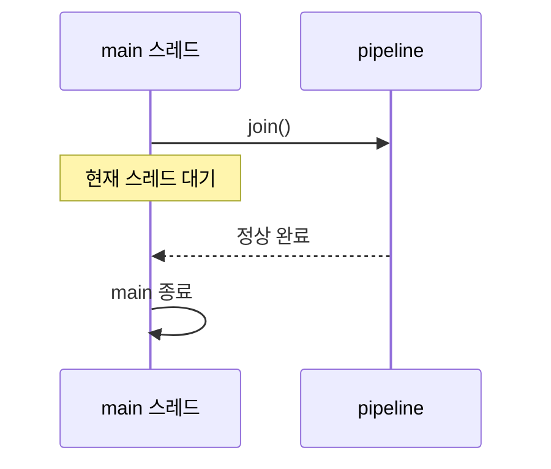

| 항목 | `join()` | `get()` |
|---|---|---|
| 대기 | 완료까지 대기 | 완료까지 대기 |
| 정상 결과 | 결과 반환 | 결과 반환 |
| 예외 형태 | 검사하지 않는 `CompletionException` | 검사 예외인 `ExecutionException` |
| 인터럽트 선언 | `InterruptedException` 선언 없음 | `InterruptedException` 처리 필요 |
| 주 사용 맥락 | `CompletableFuture` 파이프라인 | `Future` API와 호환되는 처리 |

### 인터럽트 처리

```java
catch (InterruptedException e) {
    Thread.currentThread().interrupt();
}
```

`sleep()` 중 인터럽트가 발생하면 `InterruptedException`이 발생하면서 인터럽트 상태가 지워진다. `interrupt()`를 다시 호출하는 이유는 상위 실행 흐름이 중단 요청을 알 수 있게 상태를 복원하기 위해서다.

현재 코드는 인터럽트 상태를 복원한 뒤 `"Hello!"`를 반환한다. 즉 인터럽트가 발생했을 때 작업을 예외 완료로 만들지 않고 정상 결과를 반환할 수 있다는 점도 구분해야 한다.

## 2. 면접 대비용

### 핵심 질문과 답변

| 질문 | 답변 핵심 |
|---|---|
| `CompletableFuture`의 장점은? | 비동기 작업의 결과·예외를 표현하고 변환, 조합, 복구 단계를 선언적으로 연결할 수 있다. |
| `supplyAsync()`와 `runAsync()`의 차이는? | `supplyAsync()`는 값을 반환하고, `runAsync()`는 반환값 없는 작업을 실행한다. |
| `thenApply()`와 `thenApplyAsync()`의 차이는? | 전자는 완료 스레드에서 후속 작업이 실행될 수 있고, 후자는 별도 실행자에 비동기 실행을 제출한다. |
| `thenApply()`와 `thenCompose()`의 차이는? | `thenApply()`는 값을 변환하고, `thenCompose()`는 중첩된 비동기 결과를 평탄화한다. |
| `exceptionally()`는 무엇을 하는가? | 예외를 받아 정상 대체값으로 복구한다. 정상 완료 시에는 실행되지 않는다. |
| `join()`과 `get()`의 차이는? | 둘 다 대기하지만 `join()`은 예외를 `CompletionException`으로, `get()`은 검사 예외로 전달한다. |
| 기본 비동기 실행자는 무엇인가? | 별도 실행자를 주지 않은 일반적인 `*Async` 메서드는 `ForkJoinPool.commonPool()`을 사용한다. |

### 동기·비동기 후속 단계 선택

| 메서드 | 실행 특성 | 선택 기준 |
|---|---|---|
| `thenApply()` | 이전 완료를 처리하는 스레드에서 실행될 수 있음 | 짧고 가벼운 변환 |
| `thenApplyAsync()` | 기본 또는 지정 실행자에 제출 | 실행 흐름 분리나 비용 큰 작업 |
| `thenAccept()` | 결과를 소비하고 `Void` 반환 | 로그, 저장 등 최종 소비 |
| `thenAcceptAsync()` | 소비 작업을 실행자에 제출 | 소비 작업을 별도 풀에서 실행 |

`Async` 접미사가 없는 메서드도 반드시 `main` 스레드에서 실행되는 것은 아니다. 어느 스레드가 앞 단계를 완료했는지와 등록 시점의 완료 상태 등에 따라 달라질 수 있으므로 특정 스레드에 의존하면 안 된다.

### `thenApply()`와 `thenCompose()`

비동기 함수가 또 다른 `CompletableFuture`를 반환할 때는 `thenCompose()`가 자연스럽다.

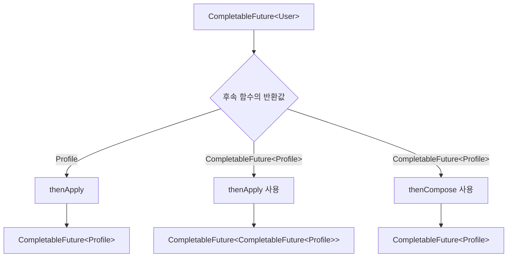

| 목적 | 사용할 메서드 |
|---|---|
| 동기 함수로 결과 변환 | `thenApply()` |
| 이전 결과로 새 비동기 작업 시작 | `thenCompose()` |
| 서로 독립적인 두 결과 결합 | `thenCombine()` |
| 앞 작업 완료 후 값 없이 작업 실행 | `thenRun()` |

### 예외 처리 메서드 비교

| 메서드 | 정상 결과 접근 | 예외 접근 | 결과 변환 | 주요 용도 |
|---|---:|---:|---:|---|
| `exceptionally()` | X | O | O | 실패 시 대체값 반환 |
| `handle()` | O | O | O | 성공·실패를 모두 하나의 결과로 변환 |
| `whenComplete()` | O | O | X | 결과를 유지하며 로깅·정리 같은 부수 효과 수행 |

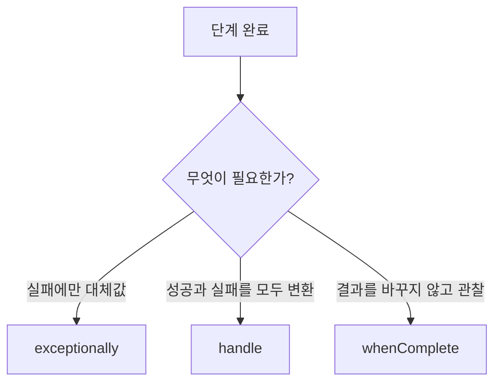

`whenComplete()` 내부에서 예외가 발생하면 최종 예외 결과에 영향을 줄 수 있으므로 단순 로깅에서도 예외를 주의해야 한다.

### 여러 Future 조합

| 메서드 | 동작 | 결과 |
|---|---|---|
| `thenCombine()` | 두 독립 작업 결과를 받아 결합 | 결합 함수의 반환값 |
| `allOf()` | 모든 작업 완료 대기 | `CompletableFuture<Void>` |
| `anyOf()` | 하나라도 먼저 완료되면 진행 | `CompletableFuture<Object>` |
| `thenCompose()` | 이전 결과에 의존하는 비동기 작업 연결 | 평탄화된 Future |

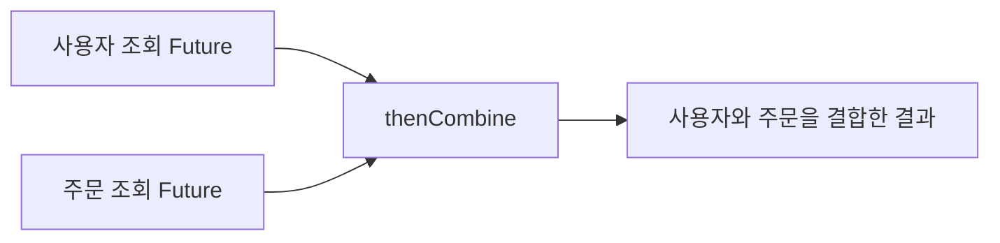

독립 작업은 동시에 시작해 결합할 수 있고, 앞 결과가 있어야 다음 요청을 만들 수 있다면 `thenCompose()`를 사용한다.

### 공통 풀 사용 시 주의점

| 위험 | 설명 | 대응 |
|---|---|---|
| 블로킹 작업 | 공통 풀 스레드가 I/O나 긴 대기로 점유됨 | 용도에 맞는 별도 `Executor` 사용 |
| 작업 간 간섭 | 애플리케이션 여러 기능이 같은 공통 풀을 공유 | 기능별 실행자 분리 검토 |
| 처리량 예측 어려움 | 다른 공통 풀 작업의 영향을 받음 | 풀 크기·큐·거부 정책을 직접 설정 |
| 무제한 대기 | `join()`에 시간 제한이 없음 | 타임아웃 API와 취소 정책 검토 |

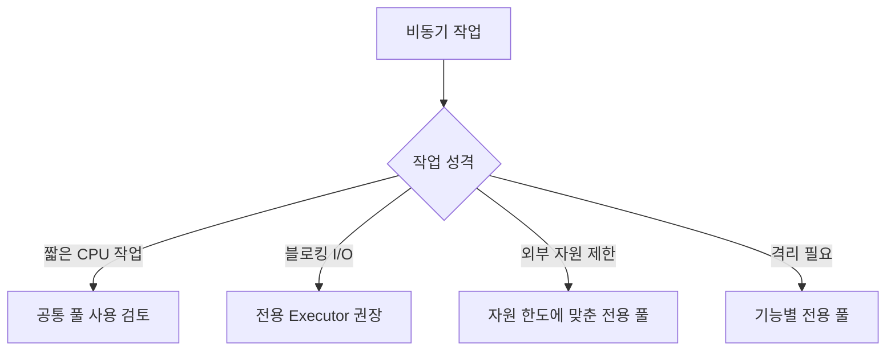

### 타임아웃과 취소

`join()`만 사용하면 작업이 끝나지 않을 때 계속 기다릴 수 있다. Java 버전에 따라 다음 API를 활용할 수 있다.

| API | 목적 |
|---|---|
| `orTimeout(timeout, unit)` | 제한 시간 후 예외 완료 |
| `completeOnTimeout(value, timeout, unit)` | 제한 시간 후 기본값으로 정상 완료 |
| `cancel(true)` | Future 취소 요청 |

Future 취소와 실제 작업 중단은 같지 않다. 실행 중인 작업과 실행자가 인터럽트나 취소에 어떻게 반응하는지 별도로 설계해야 한다.

### 이 코드의 실행 흐름 답변 예시

> `supplyAsync()`가 공통 풀에서 비동기 작업을 시작합니다. 작업은 1초 후 `RuntimeException`을 발생시키므로 정상 완료에만 반응하는 `thenApply()`는 건너뜁니다. 예외는 `exceptionally()`에 전달되고 오류 문자열로 복구되면서 파이프라인이 다시 정상 상태가 됩니다. 이어서 `thenAccept()`가 복구 문자열을 출력하고 `CompletableFuture<Void>`로 완료됩니다. 마지막 `join()`은 `main` 스레드가 전체 파이프라인 완료를 기다리게 합니다.

### 설계 판단 흐름

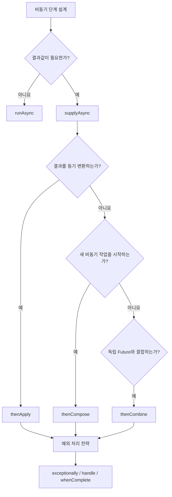

### 추가 확인 문제

1. 현재 코드에서 `thenApply()` 내부의 출력이 실행되지 않는 이유는 무엇인가?
2. `exceptionally()`가 문자열을 반환한 뒤 `thenAccept()`는 정상 실행되는가?
3. `thenApply()`와 `thenApplyAsync()`는 실행 스레드 측면에서 어떻게 다른가?
4. `CompletableFuture<CompletableFuture<T>>`를 피하려면 어떤 메서드를 사용하는가?
5. `join()`과 `get()`은 예외 처리 방식이 어떻게 다른가?
6. 블로킹 I/O 작업에 공통 풀 사용을 주의해야 하는 이유는 무엇인가?

<details>
<summary>핵심 답안</summary>

1. 앞선 `supplyAsync()` 단계가 예외 완료되어 정상 결과 기반 단계가 건너뛰어지기 때문이다.
2. 실행된다. `exceptionally()`가 예외를 정상 대체값으로 복구한다.
3. `thenApply()`는 이전 단계를 완료한 스레드에서 실행될 수 있고, `thenApplyAsync()`는 실행자에 작업을 제출한다.
4. `thenCompose()`를 사용해 중첩 Future를 평탄화한다.
5. `join()`은 `CompletionException` 같은 비검사 예외를 사용하고, `get()`은 `ExecutionException`, `InterruptedException` 같은 검사 예외를 처리해야 한다.
6. 공통 풀 스레드가 대기 작업에 점유되어 다른 비동기 작업의 처리량과 응답 시간까지 저하시킬 수 있기 때문이다.

</details>
