# Solution06: 함수형 인터페이스, 람다, 메서드 참조

`Solution06.java`는 하나의 동작을 표현하는 세 가지 방법과 람다가 외부 변수를 캡처하는 규칙을 다룬다.

1. 익명 클래스
2. 람다식
3. 메서드 참조

## 1. 초심자용

### 먼저 알아둘 용어

| 용어 | 쉬운 설명 | 코드 속 예시 |
|---|---|---|
| 함수형 인터페이스 | 추상 메서드가 하나인 인터페이스 | `CustomPrinter`, `Runnable`, `Function` |
| SAM | Single Abstract Method, 단 하나의 추상 메서드 | `CustomPrinter.print()` |
| 람다식 | 이름 없이 동작을 간결하게 표현한 식 | `text -> System.out.println(text)` |
| 익명 클래스 | 이름 없는 클래스를 선언하면서 객체를 만드는 문법 | `new CustomPrinter() { ... }` |
| 메서드 참조 | 이미 존재하는 메서드를 람다 대신 가리키는 문법 | `Integer::parseInt` |
| 변수 캡처 | 람다가 자신을 둘러싼 지역 변수를 사용하는 것 | `() -> arr[0]++` |
| effectively final | `final`을 쓰지 않아도 값이 다시 대입되지 않는 지역 변수 | 주석의 `int num = 1` 예시 |

### 함수형 인터페이스란?

```java
@FunctionalInterface
interface CustomPrinter {
    void print(String msg);
}
```

함수형 인터페이스는 추상 메서드가 하나인 인터페이스다. 람다는 독립적인 타입이 아니라, 함수형 인터페이스의 단일 추상 메서드를 구현하는 객체로 해석된다.

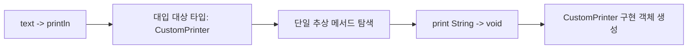

| 구성 | 의미 |
|---|---|
| `@FunctionalInterface` | 함수형 인터페이스 규칙을 컴파일러가 검사하도록 요청 |
| `void print(String msg)` | 람다가 구현할 단일 추상 메서드 |
| `(text) -> ...` | `String` 하나를 받아 반환값 없이 실행할 동작 |

`@FunctionalInterface`는 필수는 아니지만 사용하는 편이 좋다. 추상 메서드가 실수로 두 개 이상 추가되면 컴파일 오류로 알려 준다.

### 추상 메서드가 정확히 하나라는 의미

함수형 인터페이스는 추상 메서드가 하나여야 하지만 `default`, `static`, `private` 메서드는 추가할 수 있다. `Object`의 공개 메서드를 재선언하는 것도 SAM 개수에 일반적으로 포함되지 않는다.

| 메서드 종류 | 여러 개 선언 가능 | SAM 개수에 포함 |
|---|---:|---:|
| 추상 메서드 | 하나만 가능 | O |
| `default` 메서드 | O | X |
| `static` 메서드 | O | X |
| `private` 메서드 | O | X |

### 익명 클래스에서 람다로

`runOld()`는 익명 클래스로 `CustomPrinter`를 구현한다.

```java
CustomPrinter printer = new CustomPrinter() {
    @Override
    public void print(String msg) {
        System.out.println("익명 클래스에서 %s".formatted(msg));
    }
};
```

`runNew()`는 같은 인터페이스를 람다로 구현한다.

```java
CustomPrinter printer = text ->
        System.out.println("람다식에서 %s".formatted(text));
```

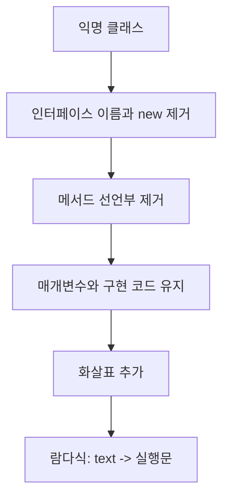

| 항목 | 익명 클래스 | 람다식 |
|---|---|---|
| 코드 길이 | 상대적으로 김 | 간결함 |
| 대상 | 인터페이스 또는 클래스 | 함수형 인터페이스만 가능 |
| `this` | 익명 클래스 객체 | 람다를 감싼 외부 객체 |
| 자체 스코프 | 새로운 클래스 스코프 생성 | 바깥 스코프와 밀접하게 연결 |
| 적합한 경우 | 상태·추가 메서드·명시적 객체 구조 필요 | 하나의 동작 전달 |

### 람다 문법


| 형태 | 예시 | 설명 |
|---|---|---|
| 매개변수 없음 | `() -> runNew()` | 빈 괄호 필요 |
| 매개변수 하나 | `text -> println(text)` | 타입 추론 시 괄호 생략 가능 |
| 매개변수 여러 개 | `(a, b) -> a + b` | 괄호 필요 |
| 표현식 본문 | `x -> x * 2` | 표현식 결과가 반환값 |
| 블록 본문 | `x -> { return x * 2; }` | 여러 문장에는 중괄호 사용 |

람다 매개변수 타입은 대입되는 함수형 인터페이스의 메서드 시그니처로부터 추론된다.

### 대상 타입과 타입 추론

같은 모양의 람다도 어느 함수형 인터페이스에 대입되는지에 따라 의미가 정해진다.

```java
Runnable task = () -> System.out.println("실행");
```

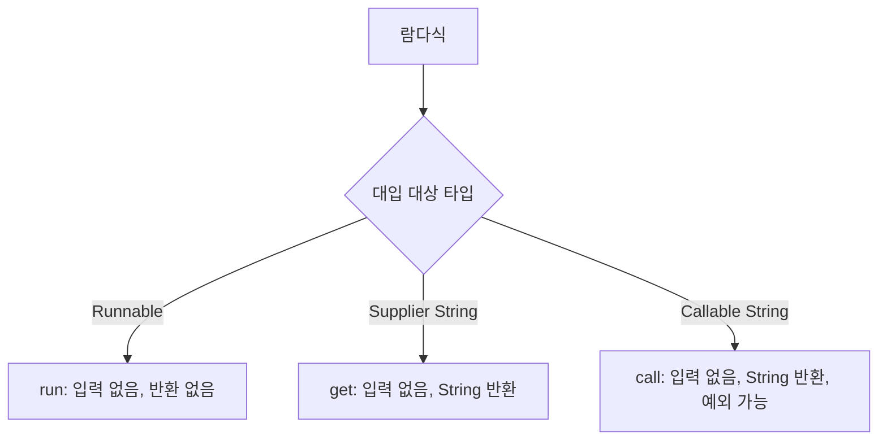

람다만 단독으로 보고 타입을 정하는 것이 아니라 변수 선언, 메서드 매개변수, 반환 타입 같은 주변 문맥을 함께 사용한다. 이를 **target typing**이라고 한다.

### `Runnable.run()`과 새 스레드

```java
Runnable r = () -> arr[0]++;
r.run();
r.run();
```

`run()`을 직접 호출하면 현재 스레드에서 일반 메서드처럼 실행된다. 새 스레드를 시작하지 않는다.

| 호출 | 실행 스레드 | 새 스레드 생성 |
|---|---|---:|
| `r.run()` | 현재 스레드 | X |
| `new Thread(r).start()` | 새로 시작된 스레드 | O |

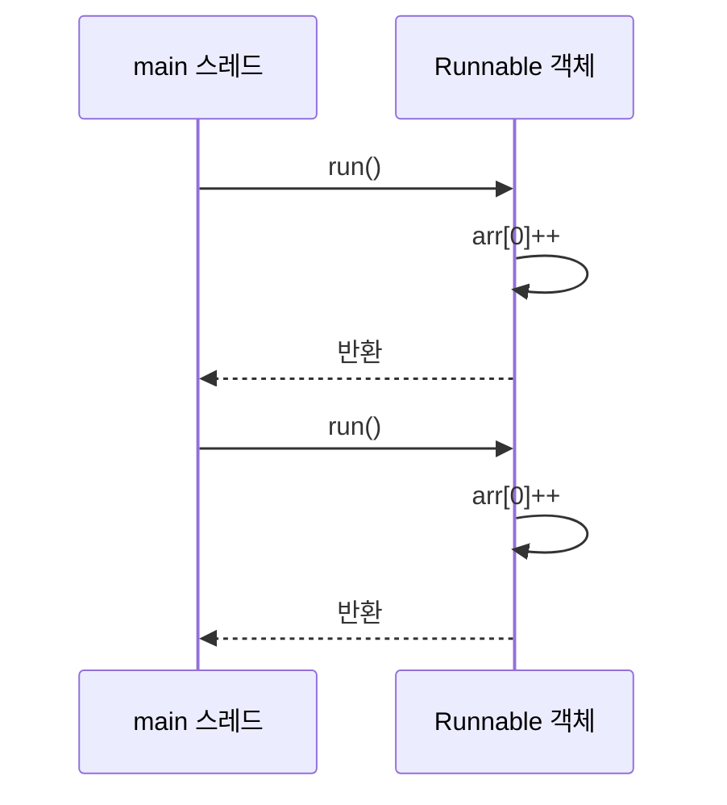

### 지역 변수 캡처와 effectively final

람다가 바깥 메서드의 지역 변수를 사용하려면 그 변수는 `final`이거나 effectively final이어야 한다.

```java
final int num = 1;
// Runnable r = () -> System.out.println(num);
```

```java
int num = 1;
// num++; // 다시 대입하면 effectively final이 아님
// Runnable r = () -> System.out.println(num); // 컴파일 불가
```

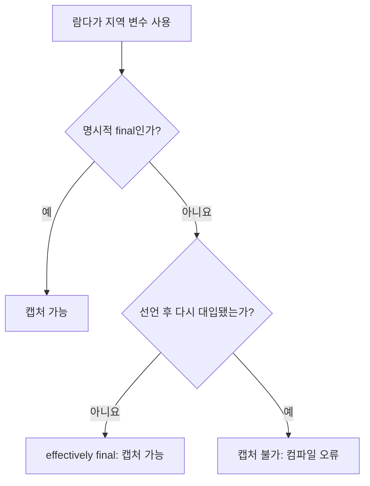

| 지역 변수 상태 | 람다 캡처 가능 |
|---|---:|
| `final int n = 1` | O |
| `int n = 1` 이후 변경 없음 | O |
| `int n = 1` 이후 `n++` | X |
| `int n = 1` 이후 조건부 재대입 가능 | X |

지역 변수는 메서드 실행이 끝나면 원래 스택 범위를 벗어날 수 있지만 람다 객체는 더 오래 살아남을 수 있다. Java는 변경되지 않는 값을 캡처하도록 제한해 생명주기와 값 일관성 문제를 단순화한다.

### `final` 배열인데 내부 값은 왜 바뀌는가?

```java
final int[] arr = {1};
arr[0] = 100;
Runnable r = () -> arr[0]++;
```

`final`이 고정하는 것은 배열 객체 자체가 아니라 지역 변수 `arr`에 저장된 **참조**다.

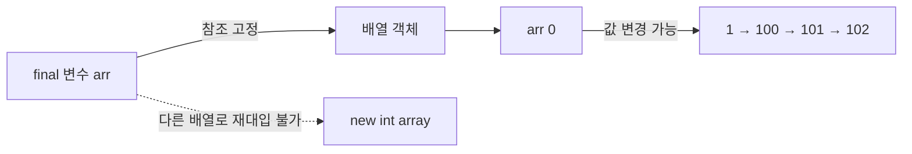

| 연산 | 가능 여부 | 이유 |
|---|---:|---|
| `arr[0] = 100` | O | 배열 객체 내부 상태 변경 |
| `arr[0]++` | O | 배열 요소 변경 |
| `arr = new int[]{2}` | X | `final` 참조 재대입 |
| 람다에서 `arr[0]++` | O | 캡처한 참조 자체는 바뀌지 않음 |

> 이 방식이 멀티스레드 환경에서도 자동으로 안전하다는 뜻은 아니다. 여러 스레드가 `arr[0]++`를 동시에 실행하면 경쟁 상태가 발생할 수 있다.

### 메서드 참조란?

람다가 기존 메서드 하나를 그대로 호출하기만 한다면 `::` 문법으로 더 간결하게 표현할 수 있다.

```java
Runnable r2 = Solution06::runNew;
Function<String, Integer> f = Integer::parseInt;
Runnable r3 = System.out::println;
A a = new A();
Runnable r4 = a::a;
```

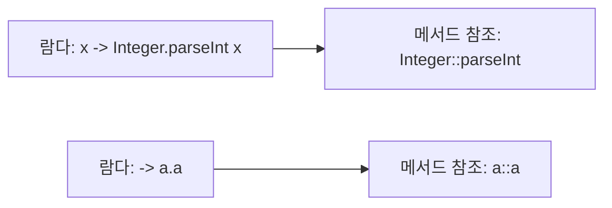

메서드 참조는 메서드를 즉시 호출하는 문법이 아니다. 호출 방법을 함수형 인터페이스 객체로 전달한다.

### 메서드 참조 유형

| 유형 | 형식 | 코드 예시 | 대응 람다 |
|---|---|---|---|
| 정적 메서드 | `클래스::정적메서드` | `Integer::parseInt` | `s -> Integer.parseInt(s)` |
| 특정 객체의 인스턴스 메서드 | `객체::인스턴스메서드` | `a::a` | `() -> a.a()` |
| 특정 객체의 인스턴스 메서드 | `객체::인스턴스메서드` | `System.out::println` | `() -> System.out.println()` |
| 임의 객체의 인스턴스 메서드 | `클래스::인스턴스메서드` | `String::length` | `s -> s.length()` |
| 생성자 | `클래스::new` | `ArrayList::new` | `() -> new ArrayList()` |

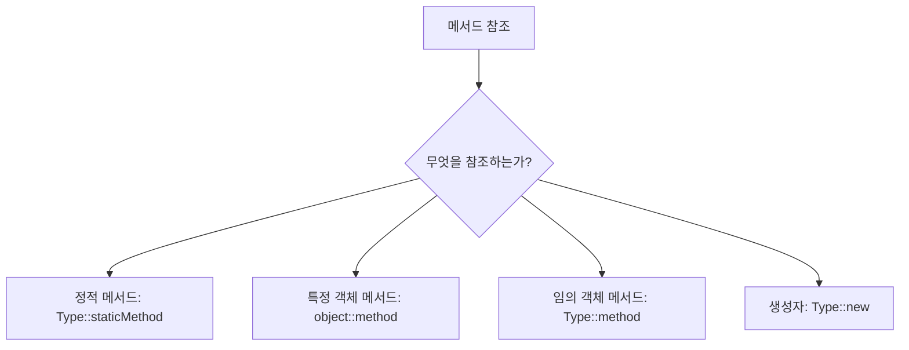

### `Function<String, Integer>` 읽는 법

```java
Function<String, Integer> f = Integer::parseInt;
```

`Function<T, R>`은 `T`를 받아 `R`을 반환하는 함수형 인터페이스다.

```mermaid
flowchart LR
    S[String 입력: "123"] --> F[Function apply]
    F --> P[Integer.parseInt]
    P --> I[Integer 결과: 123]
```

| 제네릭 | 현재 타입 | 의미 |
|---|---|---|
| `T` | `String` | 입력 타입 |
| `R` | `Integer` | 반환 타입 |
| 추상 메서드 | `R apply(T t)` | `Integer apply(String s)`로 해석 |

## 2. 면접 대비용

### 핵심 질문과 답변

| 질문 | 답변 핵심 |
|---|---|
| 함수형 인터페이스란? | 추상 메서드가 하나인 인터페이스이며 람다와 메서드 참조의 대상 타입이 된다. |
| `@FunctionalInterface`는 필수인가? | 필수는 아니지만 의도를 나타내고 컴파일러 검사를 받을 수 있어 권장된다. |
| 람다는 객체인가? | 람다식은 함수형 인터페이스의 인스턴스로 평가되지만 구현 방식과 객체 정체성을 익명 클래스처럼 가정하면 안 된다. |
| effectively final이란? | 명시적으로 `final`은 아니지만 초기화 후 다시 대입되지 않는 지역 변수다. |
| 람다가 지역 변수 변경을 제한하는 이유는? | 지역 변수 캡처의 생명주기와 값 일관성을 단순화하고 공유 가변 상태 문제를 줄이기 위해서다. |
| `final` 배열 요소는 왜 변경 가능한가? | `final`은 배열 참조의 재대입을 막을 뿐 참조 대상의 내부 상태를 불변으로 만들지 않는다. |
| 익명 클래스와 람다의 `this` 차이는? | 익명 클래스의 `this`는 익명 객체이고, 람다의 `this`는 람다를 감싼 외부 객체다. |
| 메서드 참조의 장점은? | 이미 존재하는 메서드 호출만 전달할 때 의도를 간결하게 표현한다. |
| `Runnable.run()`이 새 스레드를 만드는가? | 아니다. 새 스레드는 `Thread.start()`를 호출해야 시작된다. |

### 표준 함수형 인터페이스

| 인터페이스 | 추상 메서드 형태 | 용도 | 예시 |
|---|---|---|---|
| `Runnable` | `() -> void` | 입력·반환 없는 작업 | `Solution06::runNew` |
| `Supplier<T>` | `() -> T` | 값 생성 | `ArrayList::new` |
| `Consumer<T>` | `(T) -> void` | 값 소비 | `System.out::println` |
| `Function<T, R>` | `(T) -> R` | 값 변환 | `Integer::parseInt` |
| `Predicate<T>` | `(T) -> boolean` | 조건 검사 | `String::isBlank` |
| `UnaryOperator<T>` | `(T) -> T` | 같은 타입으로 변환 | `String::trim` |
| `BinaryOperator<T>` | `(T, T) -> T` | 같은 타입 두 값을 결합 | `Integer::sum` |

기본형 특화 인터페이스인 `IntFunction`, `ToIntFunction`, `IntConsumer` 등을 사용하면 박싱·언박싱 비용을 줄일 수 있다.

### 익명 클래스와 람다의 세부 차이

| 항목 | 익명 클래스 | 람다 |
|---|---|---|
| 대상 타입 | 인터페이스·추상/일반 클래스 | 함수형 인터페이스 |
| `this` | 익명 클래스 인스턴스 | 외부 렉시컬 스코프의 `this` |
| `super` | 익명 클래스의 상위 타입 기준 | 외부 클래스 기준 |
| 변수 이름 | 외부 지역 변수와 같은 이름 선언 가능 범위가 있음 | 외부 지역 변수와 같은 이름 재선언 불가 |
| 구현 형태 | 새 클래스 선언과 유사 | 동작 표현 |
| 직렬화 | 명시적 구현 가능하지만 주의 필요 | 직렬화에 의존하지 않는 것이 권장됨 |

람다는 동작 전달에 집중한다. 상태와 정체성이 중요한 별도 객체가 필요하다면 명명된 클래스나 익명 클래스가 더 명확할 수 있다.

### 캡처 대상에 따른 차이

| 캡처 대상 | 변경 가능 여부 | 설명 |
|---|---:|---|
| 지역 기본형 변수 | 재대입 불가 | final 또는 effectively final 필요 |
| 지역 참조 변수 | 참조 재대입 불가 | 참조 대상 내부 상태는 변경 가능 |
| 인스턴스 필드 | 변경 가능 | `this`를 통해 접근하며 지역 변수 캡처 규칙과 다름 |
| 정적 필드 | 변경 가능 | 클래스 상태로 접근 |

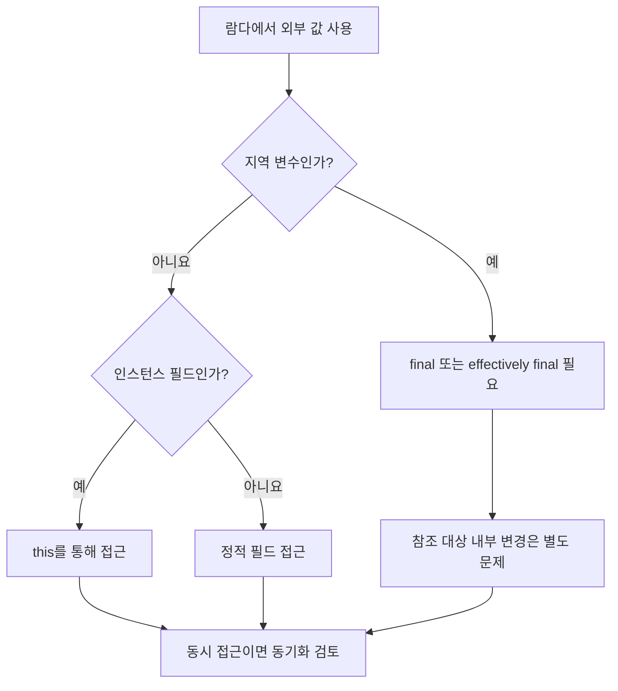

### 클로저 관점

람다는 코드뿐 아니라 실행에 필요한 주변 값을 함께 보존할 수 있다. 이런 성질을 클로저라고 설명한다.

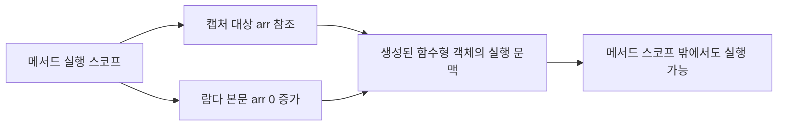

Java의 지역 변수 캡처는 변수 자체를 자유롭게 공유하는 방식이 아니라 final 또는 effectively final 값을 캡처하는 모델이다. 참조값을 캡처한 경우 그 객체의 가변 상태는 별도로 관리해야 한다.

### 메서드 참조의 시그니처 적합성

메서드 참조가 사용되려면 대상 함수형 인터페이스의 입력·출력과 참조 메서드의 호출 형태가 호환되어야 한다.

| 메서드 참조 | 대상 인터페이스 | 적합성 |
|---|---|---|
| `Solution06::runNew` | `Runnable` | 입력 없음, 반환 없음 |
| `Integer::parseInt` | `Function<String, Integer>` | `String` 입력, `int` 반환 후 박싱 |
| `System.out::println` | `Runnable` | 오버로드 중 `println()` 선택 |
| `a::a` | `Runnable` | 입력 없음, 반환 없음 |

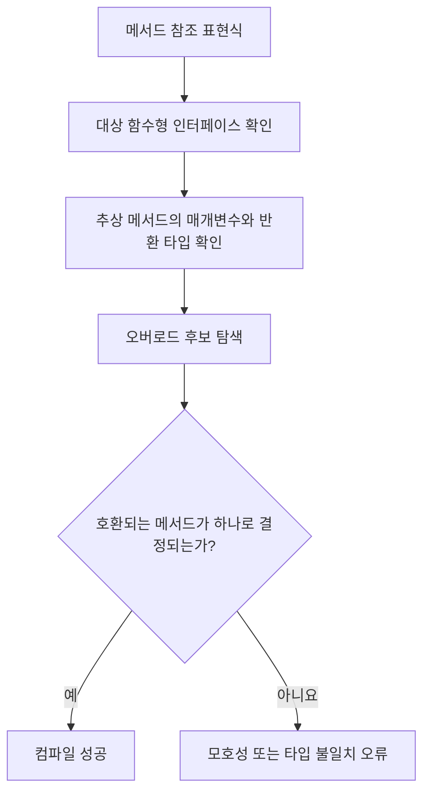

### 오버로딩과 메서드 참조

`System.out::println`처럼 오버로드된 메서드도 대입 대상 타입으로 어느 메서드를 사용할지 결정한다. 문맥만으로 하나를 선택할 수 없으면 컴파일 오류가 발생할 수 있으며, 명시적 람다나 타입 캐스팅으로 의도를 분명히 할 수 있다.

| 상황 | 대응 |
|---|---|
| 대상 타입이 명확함 | 메서드 참조 그대로 사용 |
| 오버로드 선택이 모호함 | 명시적 매개변수 타입의 람다 사용 |
| 검사 예외 시그니처 불일치 | 예외를 처리하는 람다 또는 맞는 인터페이스 사용 |
| 반환 타입 불일치 | 변환 람다나 다른 함수형 인터페이스 선택 |

### 함수 합성

표준 함수형 인터페이스는 여러 동작을 조합할 수 있다.


| 인터페이스 | 합성 메서드 | 의미 |
|---|---|---|
| `Function` | `andThen()` | 현재 함수 실행 후 다음 함수 실행 |
| `Function` | `compose()` | 전달한 함수를 먼저 실행 |
| `Predicate` | `and()`, `or()`, `negate()` | 조건 조합 |
| `Consumer` | `andThen()` | 소비 동작을 순서대로 실행 |

### 이 코드를 설명하는 답변 예시

> `CustomPrinter`는 추상 메서드가 하나인 함수형 인터페이스이므로 익명 클래스와 람다식 모두로 구현할 수 있습니다. `Runnable`과 `Function`도 표준 함수형 인터페이스이며, 기존 메서드를 그대로 전달할 때는 `Solution06::runNew`, `Integer::parseInt`, `a::a` 같은 메서드 참조를 사용할 수 있습니다. 람다가 지역 변수를 캡처하려면 해당 변수는 final 또는 effectively final이어야 합니다. `final int[] arr`에서 요소 변경이 가능한 이유는 final이 배열 참조의 재대입만 막고 객체 내부 상태까지 불변으로 만들지는 않기 때문입니다.

### 설계 선택 흐름

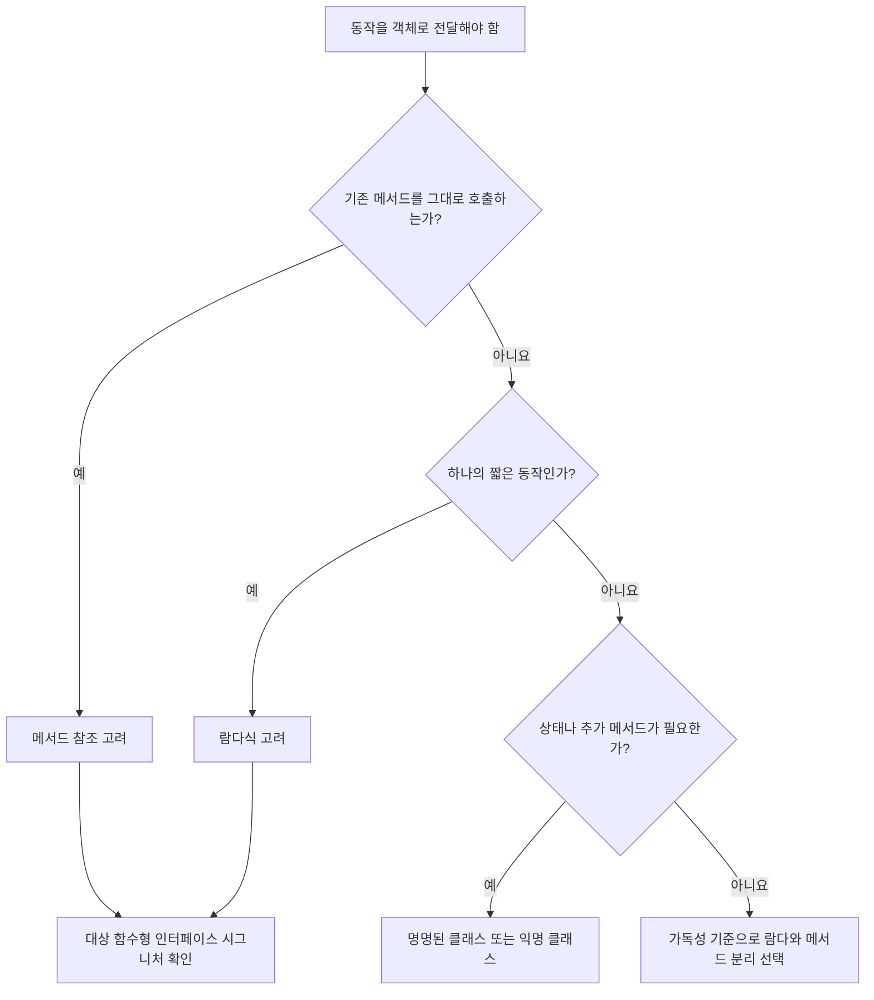

### 추가 확인 문제

1. `@FunctionalInterface`가 없어도 람다의 대상이 될 수 있는가?
2. 함수형 인터페이스에 `default` 메서드를 추가해도 되는가?
3. `int n = 1`을 람다에서 사용한 뒤 람다 밖에서 `n++`하면 왜 컴파일되지 않는가?
4. `final List<String>`에 원소를 추가할 수 있는 이유는 무엇인가?
5. `Runnable.run()`과 `Thread.start()`의 차이는 무엇인가?
6. `Integer::parseInt`가 `Function<String, Integer>`에 대입될 수 있는 이유는 무엇인가?
7. 람다와 익명 클래스에서 `this`는 각각 무엇을 가리키는가?

<details>
<summary>핵심 답안</summary>

1. 가능하다. 추상 메서드가 하나라는 구조적 조건을 만족하면 되지만 애너테이션 사용이 권장된다.
2. 가능하다. `default` 메서드는 SAM 개수에 포함되지 않는다.
3. 지역 변수가 다시 대입되어 effectively final 조건을 만족하지 않기 때문이다.
4. `final`은 리스트 참조의 재대입을 막을 뿐 리스트 객체 내부 변경을 막지 않는다.
5. `run()`은 현재 스레드의 일반 메서드 호출이고, `start()`는 새 스레드를 시작해 그 스레드에서 `run()`을 실행한다.
6. `parseInt(String)`이 문자열을 받아 `int`를 반환하며 반환값이 `Integer`로 박싱되어 시그니처가 호환되기 때문이다.
7. 람다의 `this`는 외부 객체를, 익명 클래스의 `this`는 익명 클래스 인스턴스를 가리킨다.

</details>
