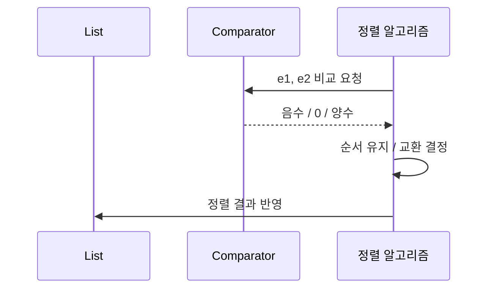
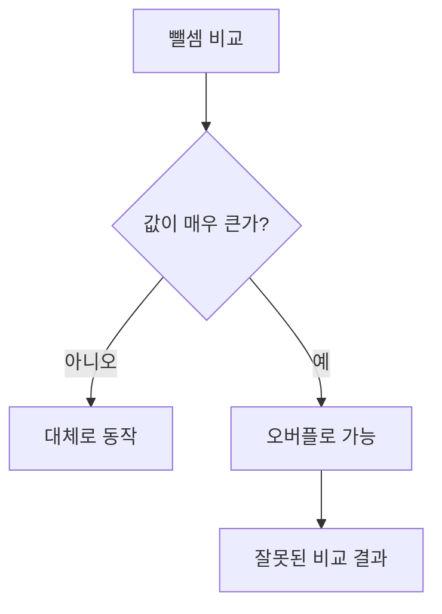
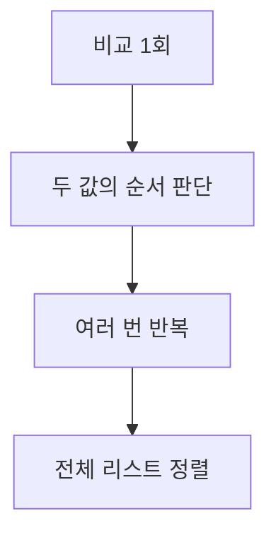
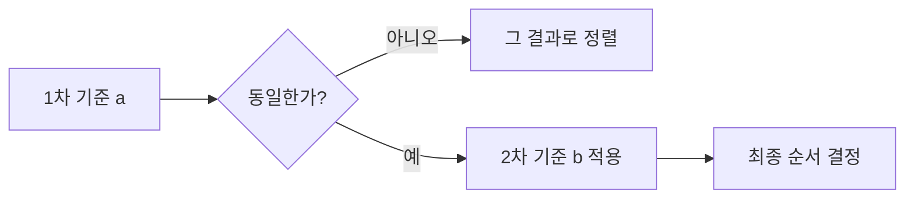

# Solution07: 정렬, Comparator, 커스텀 비교

`Solution07.java`는 `List.sort()`를 사용해 컬렉션을 정렬하는 방법과, 객체의 특정 필드를 기준으로 정렬 기준을 직접 정의하는 방법을 다룬다.

핵심은 이 세 가지다.

1. 정렬은 “어떤 순서로 나열할지”를 정하는 작업이다.
2. 원시값이나 문자열은 기본 정렬 기준이 있지만, 객체는 직접 비교 기준을 줘야 한다.
3. `Comparator`는 그 비교 기준을 함수처럼 전달하는 도구다.

## 1. 초심자용

### 먼저 알아둘 용어

| 용어 | 쉬운 설명 | 코드 속 예시 |
|---|---|---|
| 정렬(sort) | 데이터를 어떤 순서로 배열할지 정하는 작업 | `list.sort(...)` |
| 자연 순서(natural order) | 값 자체가 가진 기본 순서 | 문자열 가나다순, 숫자 오름차순 |
| 내림차순(reverse order) | 큰 값이 먼저 오도록 정렬 | `Comparator.reverseOrder()` |
| 비교자(Comparator) | 두 값을 비교하는 기준 | `(e1, e2) -> ...` |
| 람다식 | 짧게 함수처럼 동작을 전달하는 문법 | `(e1, e2) -> e1.a() - e2.a()` |
| record | 데이터를 담는 간단한 불변형 클래스 | `record Container(int a, int b)` |
| 키(key) | 정렬 기준으로 삼는 값 | `a`, `b`, 절대값 |

### 이 파일이 보여주는 것

```java
List<String> list = new ArrayList<>(List.of("참치", "꽁치", "멸치"));
list.sort(Comparator.reverseOrder());
```

이 코드는 문자열 리스트를 내림차순으로 정렬한다. 문자열은 기본적으로 비교 가능하므로 `reverseOrder()`만 붙여도 된다.

반면 아래 코드는 객체를 직접 정렬한다.

```java
List<Container> list = new ArrayList<>(
    List.of(new Container(99, -99), new Container(1, 2), new Container(2, 1))
);

list.sort((e1, e2) -> e1.a() - e2.a());
list.sort((e1, e2) -> e2.b() - e1.b());
```

`Container`는 `a`, `b`라는 두 값을 가진 객체다. 객체는 “어떤 값을 기준으로 비교할지”를 Java가 자동으로 알 수 없기 때문에, 정렬 기준을 직접 적어야 한다.

```mermaid
flowchart TD
    A[정렬 대상 List] --> B{원소 타입}
    B -->|String, Integer 같은 비교 가능 타입| C[기본 순서 사용 가능]
    B -->|Container 같은 객체| D[비교 기준 직접 작성]
    D --> E[Comparator 또는 람다 전달]
    E --> F[list.sort(...)]
```

### `List.sort()`는 무엇을 받는가?

`List.sort()`는 “비교 방법”을 인자로 받는다.

| 메서드 | 역할 |
|---|---|
| `list.sort(comparator)` | 리스트를 지정한 비교 기준으로 정렬 |
| `Comparator.reverseOrder()` | 기본 정렬 순서를 뒤집음 |
| `(e1, e2) -> ...` | 두 값을 직접 비교하는 람다 |

정렬은 결국 “A가 B보다 앞에 와야 하는가?”를 반복해서 판단하는 작업이다.



### 비교 결과 숫자의 의미

Comparator는 보통 다음 규칙을 따른다.

| 반환값 | 의미 | 정렬 결과 |
|---|---|---|
| 음수 | 첫 번째 값이 더 앞 | 현재 순서 유지 쪽 |
| 0 | 두 값이 같음 | 순서 변경 없음 |
| 양수 | 첫 번째 값이 더 뒤 | 두 원소 교환 가능 |

그래서 `e1.a() - e2.a()`는 `a` 기준 오름차순이 된다.

### `Container` record는 왜 편한가?

```java
static record Container(int a, int b) {
}
```

`record`는 데이터를 담는 목적에 맞춘 간단한 타입이다. 여기서는 `a`와 `b`를 저장하고, 자동으로 접근자 메서드 `a()`, `b()`를 제공한다.

| 항목 | 의미 |
|---|---|
| `new Container(99, -99)` | `a=99`, `b=-99`인 객체 생성 |
| `e1.a()` | 첫 번째 객체의 `a`값 조회 |
| `e2.b()` | 두 번째 객체의 `b`값 조회 |

### 필드 하나로 정렬하기

```java
list.sort((e1, e2) -> e1.a() - e2.a());
```

이 코드는 `a`가 작은 객체가 앞에 오도록 정렬한다.

```mermaid
flowchart LR
    A[Container(99, -99)] -->|a=99| B[비교]
    C[Container(1, 2)] -->|a=1| B
    B --> D[1이 먼저 오도록 순서 결정]
```

| 기준 | 식 | 결과 |
|---|---|---|
| `a` 오름차순 | `e1.a() - e2.a()` | 작은 `a` 먼저 |
| `b` 내림차순 | `e2.b() - e1.b()` | 큰 `b` 먼저 |

### 내림차순은 어떻게 만드는가?

```java
list.sort((e1, e2) -> e2.b() - e1.b());
```

비교 순서를 뒤집으면 내림차순이 된다. `e1`과 `e2`의 위치를 바꾸면 된다.

| 비교식 | 의미 |
|---|---|
| `e1 - e2` | 오름차순 |
| `e2 - e1` | 내림차순 |

### `Comparator.comparingInt()`가 더 안전한 이유

코드에는 주석으로 다음 방식도 보인다.

```java
// list.sort(Comparator.comparingInt(Math::abs));
// list.sort(Comparator.comparing(Container::a));
// list.sort(Comparator.comparing(Container::b));
```

이 방식은 “비교 기준 함수를 먼저 뽑고, 그 결과로 비교”한다.

| 방식 | 장점 | 단점 |
|---|---|---|
| `e1.a() - e2.a()` | 짧다 | 큰 수에서는 오버플로 위험이 있다 |
| `Comparator.comparingInt(Container::a)` | 의도가 분명하다 | 코드가 조금 길다 |
| `Comparator.comparingInt(Math::abs)` | 절대값 기준 정렬에 적합 | 절대값 동률 처리 규칙을 추가로 생각해야 한다 |

실무에서는 뺄셈 비교보다 `Comparator.comparingInt(...)` 계열이 더 안전한 경우가 많다.

### 왜 뺄셈 비교가 위험할 수 있는가?

정수 두 개를 빼는 방식은 값이 매우 크면 오버플로가 날 수 있다.

| 비교 방식 | 문제 가능성 |
|---|---|
| `e1.a() - e2.a()` | 큰 값에서 오버플로 가능 |
| `Integer.compare(e1.a(), e2.a())` | 상대적으로 안전 |
| `Comparator.comparingInt(Container::a)` | 더 읽기 쉽고 안전 |



### 실전 정리

| 상황 | 추천 방식 |
|---|---|
| 문자열, 숫자처럼 기본 순서가 있는 타입 | `Comparator.naturalOrder()` 또는 `reverseOrder()` |
| 객체를 한 필드 기준으로 정렬 | `Comparator.comparingInt(객체::필드)` |
| 내림차순 | `Comparator.comparingInt(...).reversed()` |
| 여러 필드 기준 정렬 | `thenComparing(...)` |

예를 들어 객체를 `a` 오름차순, `b` 내림차순으로 정렬하려면 이런 식으로도 쓸 수 있다.

```java
list.sort(
    Comparator.comparingInt(Container::a)
              .thenComparing(Comparator.comparingInt(Container::b).reversed())
);
```

## 2. 면접 대비용

### 한 문장 요약

`Solution07.java`는 컬렉션 정렬에서 `Comparator`를 이용해 객체의 필드 기준을 직접 정의하는 방법과, 비교식 작성 시 주의할 점을 보여준다.

### 자주 나오는 질문

| 질문 | 핵심 답변 |
|---|---|
| `List.sort()`는 무엇을 받나요? | 원소 두 개를 비교하는 `Comparator`를 받는다 |
| 문자열은 왜 바로 정렬되나요? | `String`은 비교 가능한 기본 순서가 있기 때문이다 |
| 객체는 왜 바로 정렬이 안 되나요? | 어떤 필드를 기준으로 비교할지 Java가 자동으로 알 수 없기 때문이다 |
| `e1.a() - e2.a()`는 왜 쓰나요? | `a` 기준 오름차순 비교를 만들기 쉽기 때문이다 |
| 그 방식의 단점은 무엇인가요? | 큰 정수에서 오버플로가 날 수 있다 |
| 더 나은 대안은 무엇인가요? | `Comparator.comparingInt(Container::a)` 또는 `Integer.compare()` |

### 면접에서 자주 묻는 포인트

#### 1. 정렬과 비교의 차이

정렬은 전체 순서를 만드는 행위이고, 비교는 두 원소 중 누가 앞에 와야 하는지 판단하는 일이다.

| 개념 | 역할 |
|---|---|
| 비교 | 두 값의 상대적 순서를 결정 |
| 정렬 | 비교를 여러 번 반복해 전체 순서를 구성 |



#### 2. Comparator 계약

Comparator는 단순히 음수/0/양수만 반환하면 끝이 아니다. 비교 결과는 일관되어야 한다.

| 요구사항 | 의미 |
|---|---|
| 반사성 | 같은 값은 0이어야 함 |
| 대칭성 | `compare(a, b)`와 `compare(b, a)`는 부호가 반대여야 함 |
| 추이성 | `a < b`, `b < c`이면 `a < c`여야 함 |

계약이 깨지면 정렬 결과가 이상해질 수 있다.

#### 3. 왜 `record`를 썼는가

`record`는 정렬 예제에서 보조 클래스를 짧게 표현하기 좋다. 필드 전달, 접근자 생성, `toString()`까지 자동으로 제공해 비교 로직에 집중할 수 있다.

| 일반 클래스 | record |
|---|---|
| 필드, 생성자, 접근자, `toString()` 직접 작성 | 대부분 자동 생성 |
| 예제 코드가 길어짐 | 예제가 짧고 명확해짐 |

#### 4. 여러 기준 정렬

정렬 기준이 하나가 아니면 `thenComparing()`을 사용한다.

```java
Comparator.comparingInt(Container::a)
          .thenComparing(Comparator.comparingInt(Container::b).reversed())
```

| 순서 | 의미 |
|---|---|
| 1차 기준 | `a` 오름차순 |
| 2차 기준 | `b` 내림차순 |



### 답변 예시

`Container` 같은 객체는 기본 정렬 순서가 없어서 `Comparator`로 비교 기준을 줘야 합니다. `e1.a() - e2.a()`처럼 필드 차이를 반환하면 오름차순 정렬이 되지만, 큰 정수에서는 오버플로 위험이 있어서 실무에서는 `Comparator.comparingInt(Container::a)` 또는 `Integer.compare()`를 더 선호합니다.

### 추가로 말하면 좋은 점

| 포인트 | 설명 |
|---|---|
| 자연 순서 | `String`, 숫자처럼 기본 비교가 가능한 타입에 적용 |
| 커스텀 순서 | 객체의 특정 필드나 복합 규칙으로 직접 정의 |
| 가독성 | `comparingInt`, `thenComparing`이 의도를 잘 드러냄 |
| 안정성 | 뺄셈 비교보다 오버플로 위험이 적음 |

### 짧은 결론

`Solution07.java`는 “정렬은 기준을 제공해야 완성된다”는 점을 보여준다. 객체 정렬에서는 `Comparator` 설계가 핵심이고, 비교식을 간단히 쓰더라도 오버플로와 비교 계약을 함께 생각해야 한다.
