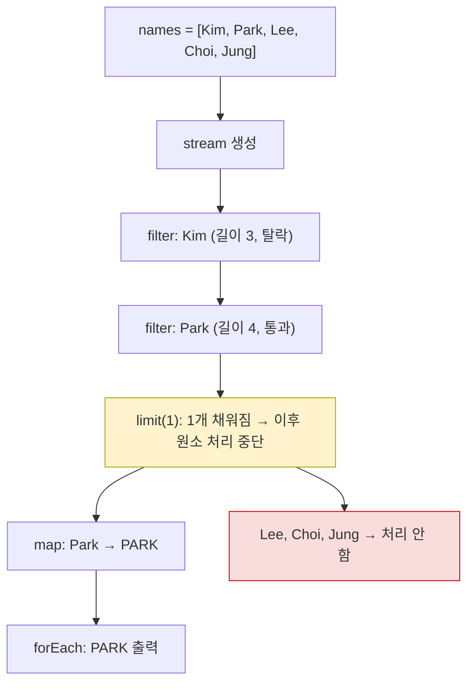
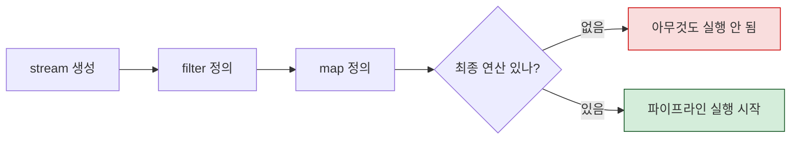
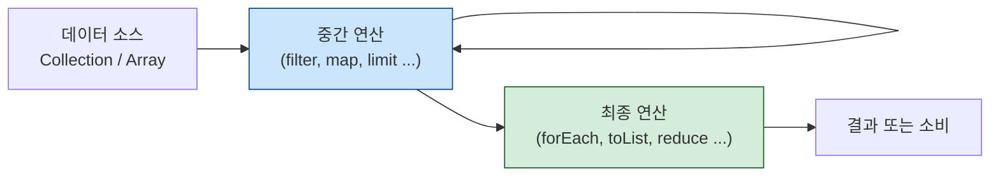
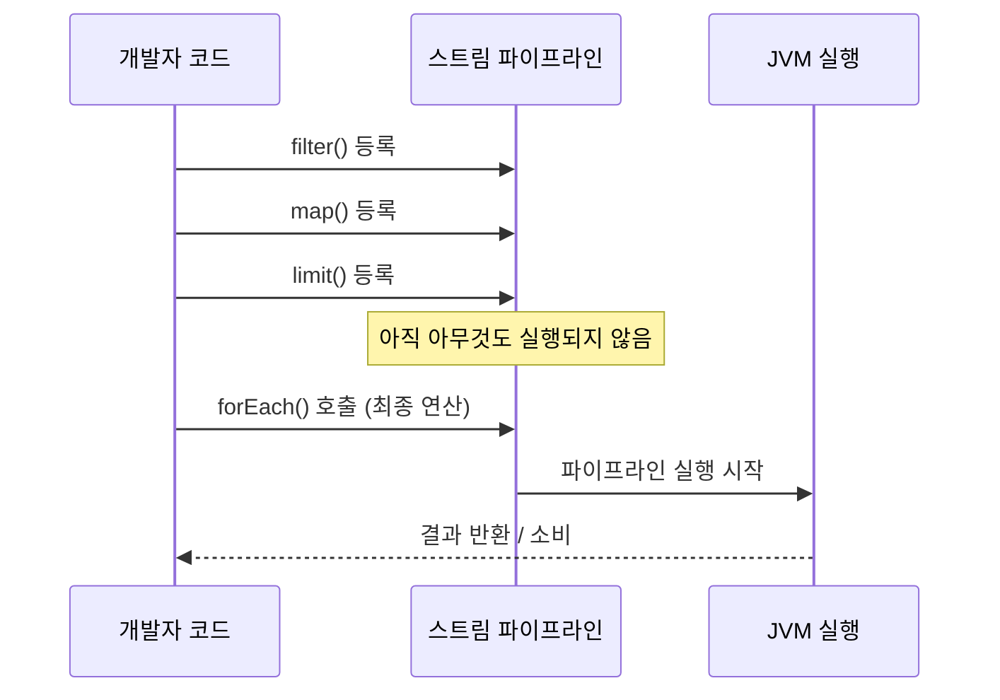
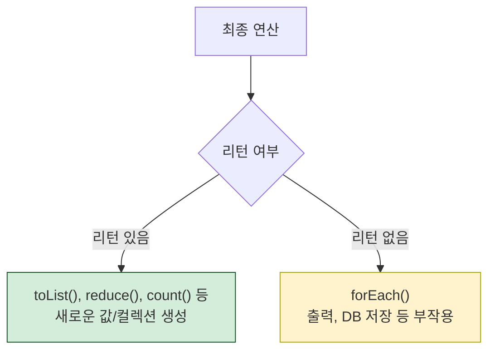

# Solution08: 스트림, 지연 평가(Lazy Evaluation), 쇼트 서킷

`Solution08.java`는 Java Stream의 핵심 동작 원리인 **지연 평가(lazy evaluation)** 와 **쇼트 서킷(short-circuit)** 을 다룬다.

핵심은 이 세 가지다.

1. 스트림은 최종 연산이 호출될 때까지 **아무것도 실행하지 않는다.**
2. 중간 연산은 파이프라인을 **정의**할 뿐이고, 실행은 최종 연산이 결정한다.
3. `limit()` 같은 쇼트 서킷 연산은 필요한 데이터만 처리하고 나머지는 **건너뛴다.**

---

## 1. 초심자용

### 먼저 알아둘 용어

| 용어 | 쉬운 설명 | 코드 속 예시 |
|---|---|---|
| 스트림(Stream) | 데이터를 하나씩 흘려보내며 처리하는 파이프라인 | `names.stream()` |
| 중간 연산 | 파이프라인에 처리 단계를 추가하는 연산. 실행되지 않음 | `filter()`, `map()`, `limit()` |
| 최종 연산 | 파이프라인을 실제로 실행시키는 연산 | `forEach()`, `toList()`, `reduce()` |
| 지연 평가(Lazy) | 필요해질 때까지 실행을 미루는 방식 | 최종 연산 전까지 아무것도 안 함 |
| 즉시 평가(Eager) | 코드를 만나는 즉시 바로 실행하는 방식 | 일반 for문, `Collections.sort()` |
| 쇼트 서킷 | 조건이 충족되면 나머지 처리를 중단하는 것 | `limit(1)` |
| 메서드 참조 | 람다를 더 짧게 쓰는 문법 | `System.out::println` |

---

### 이 파일이 보여주는 것

```java
names.stream()
     .filter(name -> {
         System.out.println("스트림 필터 : " + name);
         return name.length() > 3;
     })
     .limit(1)   // 쇼트 서킷
     .map(name -> {
         System.out.println("스트림 맵 : " + name);
         return name.toUpperCase();
     })
     .forEach(System.out::println);
```

이 코드에서 `names`는 `["Kim", "Park", "Lee", "Choi", "Jung"]`이다.  
`filter`는 길이가 3보다 큰 이름을 찾고, `limit(1)`은 딱 1개만 남긴다.

---

### 스트림의 실행 순서

스트림은 데이터를 **원소 단위** 로 처리한다.  
"Kim 전부 처리 → Park 전부 처리 → ..."가 아니라, "Kim을 filter → map → forEach, 그다음 Park을..." 순으로 진행된다.



Kim은 `filter`에서 탈락해 `map`까지 가지 않는다.  
Park이 `limit(1)`을 채우는 순간 Lee, Choi, Jung은 `filter`조차 실행하지 않는다.

---

### 최종 연산이 없으면?

```java
names.stream()
     .filter(name -> name.length() > 3)
     .map(String::toUpperCase);
// forEach 같은 최종 연산 없음 → 아무것도 출력되지 않음
```

스트림은 최종 연산이 없으면 파이프라인 자체가 실행되지 않는다.



---

### 중간 연산 vs 최종 연산

| 구분 | 종류 | 설명 |
|---|---|---|
| 중간 연산 | `filter()` | 조건에 맞는 원소만 통과 |
| 중간 연산 | `map()` | 원소를 다른 값으로 변환 |
| 중간 연산 | `limit(n)` | 앞에서 n개만 남김 (쇼트 서킷) |
| 중간 연산 | `sorted()` | 정렬 |
| 중간 연산 | `distinct()` | 중복 제거 |
| 최종 연산 | `forEach()` | 각 원소를 소비 (리턴값 없음) |
| 최종 연산 | `toList()` | 리스트로 수집 |
| 최종 연산 | `reduce()` | 원소들을 하나의 값으로 축약 |
| 최종 연산 | `count()` | 원소 수 반환 |
| 최종 연산 | `findFirst()` | 첫 번째 원소 반환 (쇼트 서킷) |

---

### Eager vs Lazy 비교

```java
// Eager: for문은 즉시 실행
for (String name : names) {
    if (name.length() > 3) {
        System.out.println(name.toUpperCase());
    }
}

// Lazy: stream은 forEach가 호출될 때 실행
names.stream()
     .filter(name -> name.length() > 3)
     .map(String::toUpperCase)
     .forEach(System.out::println);
```

| 구분 | Eager (일반 반복문) | Lazy (스트림) |
|---|---|---|
| 실행 시점 | 코드 작성 순서대로 즉시 | 최종 연산 호출 시 |
| 불필요한 처리 | 모든 원소를 다 순회 | 조건 충족 시 나머지 생략 가능 |
| 코드 가독성 | 명시적, 절차적 | 선언적, 파이프라인 |
| 쇼트 서킷 | 직접 `break` 등으로 처리 | `limit()`, `findFirst()` 등으로 자동 |

---

### 메서드 참조 (`::`)

```java
.forEach(System.out::println);
// 아래와 동일
.forEach(name -> System.out.println(name));
```

| 형태 | 예시 | 의미 |
|---|---|---|
| 인스턴스 메서드 참조 | `System.out::println` | `System.out`의 `println` 메서드 |
| 스태틱 메서드 참조 | `Math::abs` | `Math` 클래스의 `abs` 정적 메서드 |
| 생성자 참조 | `ArrayList::new` | `new ArrayList<>()` |

---

## 2. 면접 대비용

### 한 문장 요약

Java Stream은 **지연 평가(lazy evaluation)** 방식으로 동작하며, 최종 연산이 호출되기 전까지 중간 연산은 실행되지 않는다. `limit()` 같은 쇼트 서킷 연산을 통해 불필요한 연산을 생략할 수 있다.

---

### 자주 나오는 질문

| 질문 | 핵심 답변 |
|---|---|
| 스트림의 지연 평가란? | 최종 연산이 호출될 때까지 중간 연산이 실행되지 않는 것 |
| 중간 연산과 최종 연산의 차이? | 중간 연산은 파이프라인 정의, 최종 연산은 실행을 트리거함 |
| 쇼트 서킷이란? | `limit()`, `findFirst()` 등이 조건 충족 시 나머지 처리를 중단하는 것 |
| 스트림은 재사용 가능한가? | 아니다. 최종 연산 후 스트림은 소비되어 재사용 불가 |
| `forEach`의 리턴타입은? | `void`. 값을 반환하지 않고 소비하는 최종 연산 |
| 스트림과 for문의 차이? | 스트림은 선언적, lazy, 함수형 / for문은 명시적, eager, 절차적 |

---

### 면접에서 자주 묻는 포인트

#### 1. 스트림 파이프라인 구조



#### 2. 지연 평가가 중요한 이유



#### 3. 쇼트 서킷의 효과

`["Kim", "Park", "Lee", "Choi", "Jung"]`에서 `limit(1)` 적용 시:

| 원소 | filter 실행 | limit 판단 | map 실행 | forEach 실행 |
|---|---|---|---|---|
| Kim | ✅ (탈락) | — | ❌ | ❌ |
| Park | ✅ (통과) | ✅ (1개 채워짐) | ✅ | ✅ |
| Lee | ❌ (중단) | — | ❌ | ❌ |
| Choi | ❌ (중단) | — | ❌ | ❌ |
| Jung | ❌ (중단) | — | ❌ | ❌ |

`limit(1)` 덕분에 5개 중 2개만 filter를 거쳤다.

#### 4. 스트림 재사용 불가

```java
Stream<String> stream = names.stream().filter(n -> n.length() > 3);
stream.forEach(System.out::println); // 정상 실행
stream.forEach(System.out::println); // IllegalStateException 발생!
```

스트림은 한 번 소비되면 재사용할 수 없다. 필요하다면 소스에서 새 스트림을 만들어야 한다.

#### 5. 최종 연산의 두 가지 종류

| 종류 | 예시 | 특징 |
|---|---|---|
| 값 반환 | `toList()`, `reduce()`, `count()` | 결과를 리턴 |
| 소비(Side Effect) | `forEach()` | 리턴 없이 출력/호출 등 부작용 발생 |



---

### 답변 예시

Java Stream의 지연 평가는 최종 연산이 호출되기 전까지 중간 연산들이 파이프라인에 **등록만** 될 뿐 실행되지 않는 것을 말합니다. `limit()`, `findFirst()` 같은 쇼트 서킷 연산과 결합하면 불필요한 연산을 건너뛰어 성능을 최적화할 수 있습니다. 다만 스트림은 한 번 소비되면 재사용이 불가능하므로, 필요하다면 소스에서 새 스트림을 만들어야 합니다.

---

### 추가로 말하면 좋은 점

| 포인트 | 설명 |
|---|---|
| 선언적 프로그래밍 | "어떻게"가 아닌 "무엇을"로 코드를 작성해 가독성 향상 |
| 함수형 인터페이스 | `filter`, `map` 등은 `Predicate`, `Function` 등을 인자로 받음 |
| `null` 안전성 | `Optional`과 함께 쓰면 null 처리를 선언적으로 할 수 있음 |
| 병렬화 가능 | `.parallel()`을 추가하면 병렬 스트림으로 전환 가능 (Solution09 참고) |

---

### 짧은 결론

`Solution08.java`는 스트림의 핵심인 **"실행을 미룬다"** 는 원칙을 보여준다. 최종 연산이 없으면 실행 자체가 없고, `limit()` 같은 쇼트 서킷으로 필요한 만큼만 처리할 수 있다. 이것이 스트림이 대용량 데이터 처리에서 강점을 갖는 이유다.
