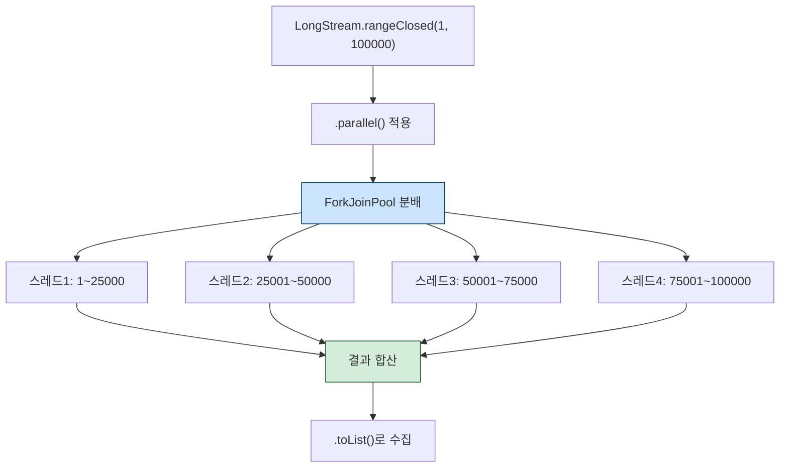
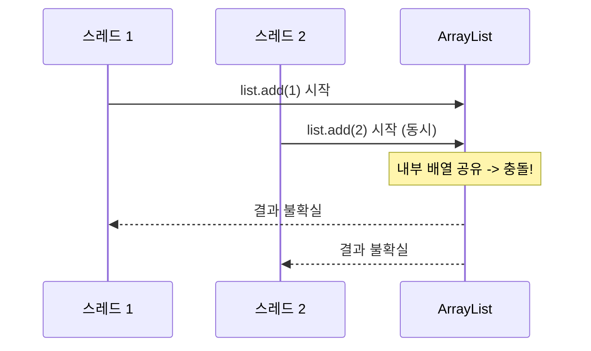
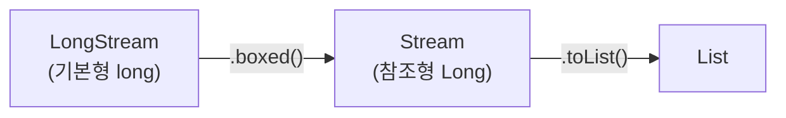
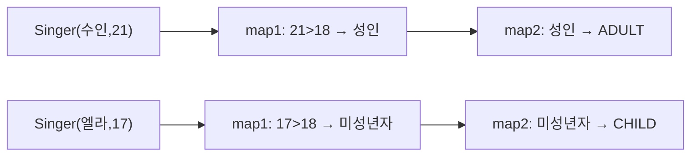
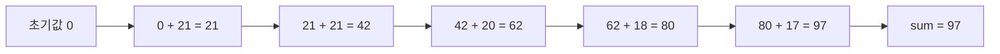
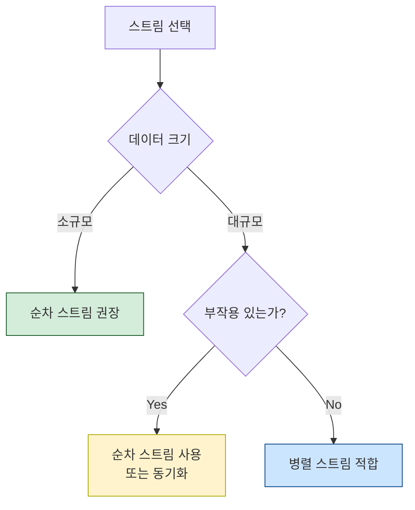
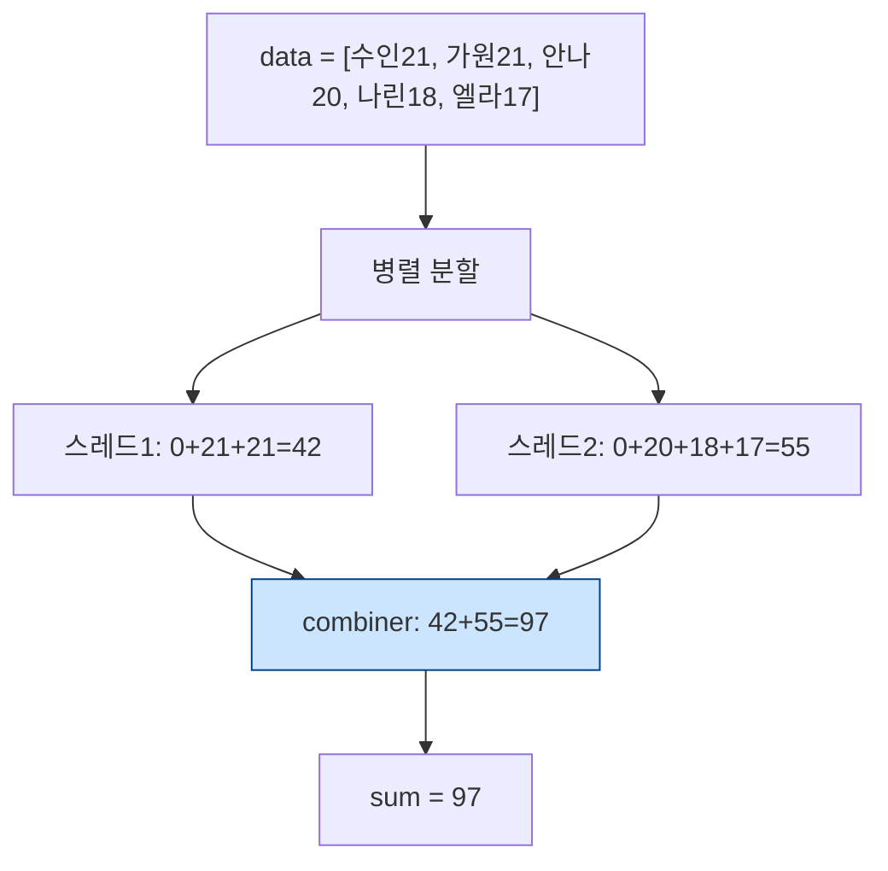
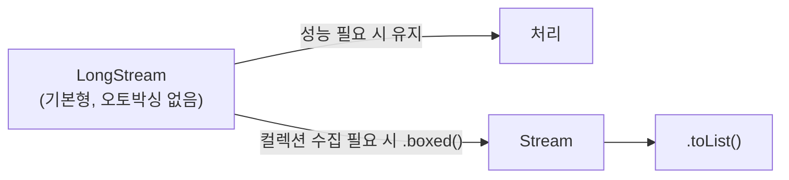

# Solution09: 병렬 스트림(Parallel Stream), reduce, map/filter

`Solution09.java`는 Java Stream의 **병렬 처리(parallel stream)** 와 **순차 처리 비교**, 그리고 `map`, `filter`, `reduce`의 동작 방식을 다룬다.

핵심은 이 세 가지다.

1. `.parallel()`을 붙이면 스트림이 여러 스레드에서 동시에 처리된다.
2. 병렬 스트림은 **순서를 보장하지 않으며**, 공유 자원 접근 시 경합(race condition)이 발생할 수 있다.
3. `reduce`는 원소들을 하나의 값으로 **누적**하며, 병렬 처리에서는 세 번째 인자(combiner)가 중요하다.

---

## 1. 초심자용

### 먼저 알아둘 용어

| 용어 | 쉬운 설명 | 코드 속 예시 |
|---|---|---|
| 순차 스트림 | 원소를 하나씩 순서대로 처리하는 스트림 | `.stream()` |
| 병렬 스트림 | 원소를 여러 스레드에서 동시에 처리하는 스트림 | `.parallel()` |
| 스레드 | 동시에 작업을 처리하는 실행 단위 | JVM이 자동으로 관리 |
| 경합(Race Condition) | 여러 스레드가 동시에 같은 자원을 수정할 때 발생하는 문제 | `list::add` 동시 호출 |
| `range` | 시작값 포함, 끝값 미포함 범위 | `LongStream.range(1, 5)` → 1,2,3,4 |
| `rangeClosed` | 시작값과 끝값 모두 포함 범위 | `LongStream.rangeClosed(1, 5)` → 1,2,3,4,5 |
| `boxed()` | 기본형 스트림 → 참조형 스트림으로 변환 | `LongStream` → `Stream<Long>` |
| `reduce` | 원소들을 하나의 값으로 합치는 연산 | 합계, 곱, 최대값 등 |
| 메서드 참조 | 패러미터와 리턴 조건이 맞으면 메서드를 람다처럼 쓰는 문법 | `list::add` |
| `record` | 데이터를 담는 간단한 불변 클래스 | `record Singer(String name, int age, String country)` |

---

### 병렬 스트림이란?

일반 스트림은 원소를 **하나씩** 처리한다. 병렬 스트림은 원소를 **여러 조각으로 나눠** 동시에 처리한다.



---

### 경합(Race Condition) 문제

코드에 주석 처리된 부분이 바로 이 문제를 보여준다.

```java
List<Long> list = new ArrayList<>();

// 문제 있는 코드 (주석 처리됨)
LongStream.rangeClosed(1, 100_000)
          .parallel()
          .forEach(list::add); // 여러 스레드가 동시에 list에 add -> 경합 발생!

System.out.println("list.size() = " + list.size()); // 100000이 아닐 수 있음
```



**안전한 해결 방법**: `toList()`나 `collect()`를 사용해 스트림 내부에서 처리하면 경합 없이 결과를 수집할 수 있다.

```java
List<Long> result = LongStream.rangeClosed(1, count)
        .parallel()
        .boxed()
        .toList(); // 안전: 스트림이 자체적으로 수집
```

---

### `range` vs `rangeClosed`

| 메서드 | 시작값 | 끝값 | 예시 (1~5) | 결과 |
|---|---|---|---|---|
| `range(1, 5)` | 포함 | 미포함 | 1, 2, 3, 4 | 4개 |
| `rangeClosed(1, 5)` | 포함 | 포함 | 1, 2, 3, 4, 5 | 5개 |

---

### `boxed()`가 필요한 이유

Java에는 **기본형(primitive)** 과 **참조형(wrapper)** 이 따로 있다.

| 기본형 | 참조형(Wrapper) |
|---|---|
| `long` | `Long` |
| `int` | `Integer` |
| `double` | `Double` |

`LongStream`은 `long` 기본형 스트림이다. `List<Long>`에 담으려면 참조형 `Long`으로 변환해야 한다.



---

### `map`, `filter`, `reduce` 정리

`runStream()` 메서드는 Singer 객체를 다양하게 가공한다.

```java
record Singer(String name, int age, String country) {}

List<Singer> data = List.of(
    new Singer("수인", 21, "한국"),
    new Singer("가원", 21, "미국"),
    new Singer("안나", 20, "일본"),
    new Singer("나린", 18, "한국"),
    new Singer("엘라", 17, "미국")
);
```

#### `map`: 원소를 변환

```java
data.stream()
    .map((el) -> el.age > 18 ? "성인" : "미성년자")
    .map((el) -> el.equals("성인") ? "ADULT" : "CHILD")
    .toList();
```



#### `filter`: 조건에 맞는 원소만 통과

```java
data.stream()
    .filter((el) -> el.age > 18)
    .toList();
```

| 이름 | 나이 | filter 통과 여부 |
|---|---|---|
| 수인 | 21 | ✅ |
| 가원 | 21 | ✅ |
| 안나 | 20 | ✅ |
| 나린 | 18 | ❌ (18 > 18은 false) |
| 엘라 | 17 | ❌ |

#### `reduce`: 원소를 하나의 값으로 축약

```java
int sum = data.stream()
    .reduce(0, (prev, cur) -> prev + cur.age, (el1, el2) -> el1 + el2);
```

| 인자 | 역할 |
|---|---|
| 1번 (`0`) | 초기값(identity). 합산을 시작할 기준값 |
| 2번 (`(prev, cur) -> prev + cur.age`) | 순차 처리 시: 직전 누적값과 현재 원소를 합치는 로직 |
| 3번 (`(el1, el2) -> el1 + el2`) | 병렬 처리 시: 각 스레드의 부분 결과를 합치는 로직 |



---

### 스트림은 원본을 변경하지 않는다

```java
System.out.println("stream1 = " + stream1); // [ADULT, ADULT, ADULT, CHILD, CHILD]
System.out.println("data = " + data);        // 원래 Singer 리스트 그대로
```

스트림 연산은 원본 `data`에 영향을 주지 않는다. `map`이나 `filter`는 새로운 스트림을 만들 뿐이다.

---

## 2. 면접 대비용

### 한 문장 요약

Java의 병렬 스트림은 ForkJoinPool을 이용해 원소를 여러 스레드에서 동시에 처리하지만, **공유 자원 접근 시 경합이 발생**할 수 있으므로 안전한 수집 방법(toList, collect)을 써야 한다.

---

### 자주 나오는 질문

| 질문 | 핵심 답변 |
|---|---|
| 병렬 스트림은 항상 빠른가? | 아니다. 데이터가 적거나 스레드 생성 비용이 크면 순차보다 느릴 수 있다 |
| 병렬 스트림의 내부 스레드 풀은? | `ForkJoinPool.commonPool()`을 사용한다 |
| `forEach` + 공유 컬렉션이 위험한 이유는? | `ArrayList`는 스레드 안전하지 않아 병렬 쓰기 시 데이터 손실이 발생할 수 있다 |
| 안전한 병렬 수집 방법은? | `.collect(Collectors.toList())`나 `.toList()` 사용 |
| `reduce`의 세 번째 인자는 언제 쓰이나? | 병렬 스트림에서 각 스레드의 부분 결과를 합칠 때 |
| `map`은 원본을 바꾸는가? | 아니다. 새로운 스트림을 생성하며 원본은 변경되지 않는다 |

---

### 면접에서 자주 묻는 포인트

#### 1. 순차 vs 병렬 스트림 비교

| 구분 | 순차 스트림 | 병렬 스트림 |
|---|---|---|
| 생성 방법 | `.stream()` | `.stream().parallel()` 또는 `.parallelStream()` |
| 처리 방식 | 단일 스레드, 순서 보장 | 다중 스레드, 순서 미보장 |
| 적합한 데이터 크기 | 소~중간 | 대용량 |
| 주의사항 | 없음 | 공유 자원 접근 금지 |
| 사용 스레드 풀 | 없음 (단일) | `ForkJoinPool.commonPool()` |



#### 2. Race Condition 심화

```java
// 위험: ArrayList는 스레드 안전하지 않음
List<Long> list = new ArrayList<>();
LongStream.rangeClosed(1, 100_000)
          .parallel()
          .forEach(list::add); // 경합 발생 가능

// 안전1: toList() (JDK16+)
List<Long> safe1 = LongStream.rangeClosed(1, 100_000)
                             .parallel()
                             .boxed()
                             .toList();

// 안전2: 동기화된 컬렉션
List<Long> safe2 = Collections.synchronizedList(new ArrayList<>());
```

#### 3. `reduce` 3인자 버전의 동작



병렬 처리 시 각 스레드가 부분합을 계산하고, combiner(3번째 인자)가 부분합들을 합친다.  
순서가 보장되지 않으므로 **순서에 의존하는 로직은 reduce에 쓰면 안 된다.**

#### 4. 기본형 스트림 vs 참조형 스트림

| 종류 | 예시 | 특징 |
|---|---|---|
| 기본형 스트림 | `IntStream`, `LongStream`, `DoubleStream` | 오토박싱 없음, 성능 유리 |
| 참조형 스트림 | `Stream<Integer>`, `Stream<Long>` | 박싱 비용 발생 |

대용량 숫자 처리에는 `IntStream`, `LongStream`이 `Stream<Integer>`, `Stream<Long>`보다 성능이 좋다.



#### 5. `toList()` vs `collect(Collectors.toList())`

| 구분 | `toList()` (JDK 16+) | `collect(Collectors.toList())` |
|---|---|---|
| 가용 버전 | JDK 16 이상 | 모든 버전 |
| 수정 가능 여부 | 불변 리스트 반환 | 가변 리스트 반환 |
| 코드 길이 | 짧음 | 김 |
| 추천 상황 | 수정이 필요 없을 때 | 수정이 필요하거나 하위 버전 지원 필요 시 |

---

### 답변 예시

> 병렬 스트림은 `ForkJoinPool`을 사용해 원소를 여러 스레드에서 동시에 처리합니다. 그러나 `ArrayList` 같이 스레드 안전하지 않은 컬렉션에 병렬로 쓰면 경합이 발생해 데이터 손실이 생길 수 있습니다. 이때는 `toList()`나 `collect()`처럼 스트림이 안전하게 수집하는 방법을 써야 합니다. 또한 병렬 스트림이 항상 빠른 것은 아니고, 데이터 규모가 작거나 CPU 코어가 적으면 오히려 스레드 생성 비용 때문에 순차보다 느릴 수 있습니다.

---

### 추가로 말하면 좋은 점

| 포인트 | 설명 |
|---|---|
| ForkJoinPool | `Runtime.getRuntime().availableProcessors()` 개수만큼 스레드를 만들어 사용 |
| 순서 보장 | 병렬 스트림에서도 `forEachOrdered()`를 쓰면 삽입 순서를 유지할 수 있음 |
| Spliterator | 스트림이 데이터를 분할하는 방식. 커스텀 데이터 구조에서 병렬성 향상에 활용 |
| 부작용 금지 | 병렬 스트림의 람다에서 외부 상태를 변경하면 비결정적 결과가 나올 수 있음 |

---

### 짧은 결론

`Solution09.java`는 `.parallel()`이 얼마나 쉽게 적용되는지와, 그 이면의 **경합 문제**가 얼마나 치명적인지를 동시에 보여준다. 병렬 스트림은 공유 자원 없이 순수한 계산에 쓰고, 결과 수집은 `toList()` 같은 안전한 방식을 사용하는 것이 핵심이다.
